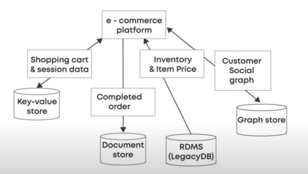

## What is System Design?
System design is the process of designing the elements of a system such as the architecture, modules and components, the different interfaces of those components and the data that goes through that system.

**Type of System design**
- High Level Design
- Low Level Design

**High Level Design(HLD)**
- It describe the main components that would be developed for the resulting product.
- The system architecture details, database design, services adn processes, the relationship between various modules, and features

**Low level Design(LLD)**
- It describe the design of each element mentioned in the High level design of the system.
- Classes, interfaces, relationships between different classes and actual logic of the various components.

## Architecture
Internal design details for building the applications

### Monolithic Architecture

Monolithic Architecture is a software design approach where an entire application is built as a single, unified unit. All components, features, and functionalities are tightly coupled and deployed together as one large codebase.

**Key Characteristics:**
- Single Deployable Unit: Entire application packaged and deployed as one unit
- Shared Database: All components use the same database
- Centralized Business Logic: All features in one codebase
- Tight Coupling: Components are interdependent
- Web Application Example: E-commerce Platform

```js
// Monolithic E-commerce Application Structure

// Single Application Entry Point
const express = require('express');
const app = express();

// All modules in one application
const userController = require('./controllers/userController');
const productController = require('./controllers/productController');
const orderController = require('./controllers/orderController');
const paymentController = require('./controllers/paymentController');
const inventoryController = require('./controllers/inventoryController');

// Shared Database Connection
const database = require('./config/database');

// All Routes in One Place
app.use('/api/users', userController);
app.use('/api/products', productController);
app.use('/api/orders', orderController);
app.use('/api/payments', paymentController);
app.use('/api/inventory', inventoryController);

// Single Port for Entire Application
app.listen(3000, () => {
    console.log('E-commerce Monolith running on port 3000');
});

```
**Monolithic File Structure**
ecommerce-monolith/
├── controllers/
│   ├── userController.js      // User management
│   ├── productController.js   // Product catalog
│   ├── orderController.js     // Order processing
│   ├── paymentController.js   // Payment handling
│   └── inventoryController.js // Inventory management
├── models/
│   ├── User.js
│   ├── Product.js
│   ├── Order.js
│   └── Payment.js
├── services/
│   ├── authService.js
│   ├── emailService.js
│   └── notificationService.js
├── config/
│   └── database.js           // Single database config
├── utils/
└── app.js                    // Main application file

**Example Implementation**
```js
// controllers/orderController.js
const Order = require('../models/Order');
const User = require('../models/User');
const Product = require('../models/Product');
const Payment = require('../models/Payment');
const emailService = require('../services/emailService');

class OrderController {
    async createOrder(req, res) {
        try {
            // All business logic in one place
            const { userId, products, paymentInfo } = req.body;
            
            // User validation
            const user = await User.findById(userId);
            if (!user) {
                return res.status(404).json({ error: 'User not found' });
            }
            
            // Product validation and inventory check
            for (let item of products) {
                const product = await Product.findById(item.productId);
                if (!product || product.stock < item.quantity) {
                    return res.status(400).json({ error: 'Insufficient stock' });
                }
            }
            
            // Create order
            const order = new Order({
                userId,
                products,
                total: calculateTotal(products),
                status: 'pending'
            });
            
            // Process payment
            const payment = await Payment.create({
                orderId: order._id,
                amount: order.total,
                paymentMethod: paymentInfo.method
            });
            
            // Update inventory
            for (let item of products) {
                await Product.findByIdAndUpdate(
                    item.productId,
                    { $inc: { stock: -item.quantity } }
                );
            }
            
            // Send confirmation email
            await emailService.sendOrderConfirmation(user.email, order);
            
            await order.save();
            res.status(201).json(order);
            
        } catch (error) {
            res.status(500).json({ error: error.message });
        }
    }
}

module.exports = new OrderController();
```

**Advantages of Monolithic Architecture:**
- ✅ Simplicity
    - Single codebase to manage
    - Easy to understand and develop initially
    - Straightforward testing and debugging
- ✅ Development Speed
    - Faster initial development
    - No network calls between components
    - Shared libraries and utilities
- ✅ Deployment
    - Simple deployment process
    - Single deployable unit
    - Easy rollback strategies
- ✅ Performance
    - No network latency between components
    - Efficient in-process communication
    - Better performance for small to medium applications
**Disadvantages of Monolithic Architecture:**
- ❌ Scalability Issues
    - Must scale entire application even if only one component needs scaling
    - Resource waste on unused components
- ❌ Technology Lock-in
    - Entire application uses same technology stack
    - Difficult to adopt new technologies for specific features
- ❌ Development Challenges
    - Large codebase becomes difficult to maintain
    - Team coordination issues
    - Longer build and deployment times
- ❌ Single Point of Failure
    - If one component fails, entire application goes down
    - No fault isolation
    
Real-World Example: Traditional Web Application
```js
// Traditional Blog Application (Monolithic)
const express = require('express');
const app = express();

// All functionality in one application
app.get('/posts', (req, res) => {
    // Fetch all blog posts
    const posts = database.getAllPosts();
    res.render('posts', { posts });
});

app.post('/posts', (req, res) => {
    // Create new post
    const post = database.createPost(req.body);
    emailService.notifySubscribers(post);
    res.redirect('/posts');
});

app.get('/users', (req, res) => {
    // User management
    const users = database.getAllUsers();
    res.render('users', { users });
});

app.post('/comments', (req, res) => {
    // Comment system
    const comment = database.createComment(req.body);
    notificationService.notifyAuthor(comment);
    res.redirect(`/posts/${comment.postId}`);
});

// Single deployment
app.listen(3000);

```
**When to Use Monolithic Architecture:**

- Small to medium-sized applications
- Simple applications with limited complexity
- Startups or proof-of-concept projects
- Teams with limited distributed systems experience
- Applications with predictable load patterns
**Example Scenarios:**
- Corporate website with CMS
- Small e-commerce store
- Internal business applications
- MVPs (Minimum Viable Products)

Monolithic architecture is often the right choice for many applications, especially when starting out. The key is knowing when to transition to microservices as your application grows in complexity and scale.


## Cache Eviction Techniques
1. LRU : Least recently used
2. MRU : Most recently used
3. LFU : Least frequently used
4. FIFO : First in first out 
5. LIFO : Last in first out
6. RR : Round Robin


## File based storage system
A file-based storage system is a database management system where data is stored in the form of files.

Challenges
1. Data Redundancy : Undate anamoly, delete anamoly leading to data inconsistency
2. Poor Security : Same data are present in the system which causes a possibility of unauthorized usese
3. Slow : the speed is very slow. Due to these challenges, data retrieval is not very efficient.

**Important** : To overcome of file based storage system, we use RDBMS.

## RDBMS
- Software : It is a software that performs data operations on relational database.
- Operatoins : It store, manage, query and retrieve data.
- Tables : Data is represented in the form of tables.
- Foreign Keys : The relationship between the two tables is represented by foreign keys.

**Advantages**
- No Data redundancy and inconsistency
- Data Searching - Build it searching capabilities (no need of a separate programme as in FS)
- Data concurrency : A locking system is provided by RDBMS to prevent abnormalities from occuring.
- Data Integrity - To maintain data integrity numeric columns won't have alphabetic data. (There is no process in the file system to check these constraints automatically)

**Disadvantages**
- Problem 1 : Ridig schema
- Problem 2 : High Cost
- Problem 3 : Scalability Issue (Horizontal scalling / Sharding is very difficult)

## NoSQL Databases
It stand for "non-sql" database or we can say that it is a non-relational database.

**Types of NoSQL Databases**
NoSQL is the umbrella term comprising of four different types of databases.

Below is a concise explanation of the **definition**, **differences**, and **examples** for **key-value databases**, **document databases**, **columnar databases**, and **graph databases**.

---

### 1. Key-Value Database
**Definition**: 
A key-value database is a NoSQL database that stores data as a collection of key-value pairs, where each key is a unique identifier associated with a value. It’s simple, highly scalable, and optimized for fast retrieval.

**Key Characteristics**:
- Data is stored as key-value pairs (like a dictionary or hash table).
- Best for simple queries and high-speed lookups.
- Schema-less, offering flexibility in data types.
- Limited querying capabilities compared to other databases.

**Example**:
- **Database**: Redis, Amazon DynamoDB, Riak.
- **Use Case**: Caching, User Profiles, Shopping Cart, i.e Caching session data for a web application, e.g., storing user session IDs and their associated data (like `{ "user123": { "name": "Alice", "cart": ["item1", "item2"] } }`).

---

### 2. Document Database
**Definition**: 
A document database is a NoSQL database that stores data as semi-structured documents, typically in JSON, BSON, or XML format. Each document contains key-value pairs and can have nested structures.

**Key Characteristics**:
- Stores data as flexible, self-contained documents.
- Supports complex queries, indexing, and aggregation.
- Schema-less, allowing varied document structures.
- Ideal for hierarchical or semi-structured data.

**Example**:
- **Database**: MongoDB, CouchDB, Firebase Firestore.
- **Use Case**: CMS, Blogging, User Data with flexible schemas, i.e Storing user profiles in an e-commerce platform, e.g., a document like `{ "_id": "user123", "name": "Alice", "address": { "city": "New York", "zip": "10001" }, "orders": ["order1", "order2"] }`.

---

### 3. Columnar Database (Column-Family Database)
**Definition**: 
A columnar database stores data in columns rather than rows, optimizing for analytical queries and large-scale data processing. It’s designed for high-performance reads on specific columns.

**Key Characteristics**:
- Data is organized by columns, enabling efficient querying of specific fields.
- Optimized for analytical workloads, aggregations, and big data.
- Highly compressible due to similar data types in columns.
- Often used in data warehousing and business intelligence.

**Example**:
- **Database**: Apache Cassandra, Google BigQuery, Amazon Redshift, HBase.
- **Use Case**: Real-time analytics, Time-series data, High-volume write-heavy apps, i.e. Analyzing sales data, e.g., querying only the "revenue" and "date" columns from a massive dataset to calculate monthly sales trends.

---

### 4. Graph Database
**Definition**: 
A graph database is a NoSQL database that uses graph structures (nodes, edges, and properties) to represent and query relationships between data entities.

**Key Characteristics**:
- Optimized for complex relationships and traversals.
- Nodes represent entities, and edges represent relationships.
- Highly efficient for queries involving interconnected data.
- Ideal for social networks, recommendation systems, and fraud detection.

**Example**:
- **Database**: Neo4j, ArangoDB, OrientDB.
- **Use Case**: social networks, recommendation systems, and fraud detection e.g., storing users as nodes and friendships as edges to query "friends of friends" (like `{ Node: "Alice", Edge: "friend", Node: "Bob"}`). 

---

### Key Differences
| **Feature**                | **Key-Value DB**                     | **Document DB**                     | **Columnar DB**                     | **Graph DB**                        |
|----------------------------|--------------------------------------|-------------------------------------|-------------------------------------|-------------------------------------|
| **Data Model**             | Key-value pairs                     | Semi-structured documents (JSON/BSON) | Column-based storage                | Nodes and edges (graph structure)   |
| **Query Flexibility**      | Simple lookups by key               | Rich queries (fields, nested data)  | Analytical queries on columns       | Relationship-based queries          |
| **Scalability**            | Highly scalable, simple operations  | Scalable, supports complex queries  | Scalable for large datasets         | Scalable for relationship-heavy data|
| **Use Case**               | Caching, sessions, simple lookups   | Content management, e-commerce      | Data warehousing, analytics         | Social networks, recommendations    |
| **Schema**                 | Schema-less                         | Schema-less                         | Schema-defined (columns)            | Schema-less or semi-structured      |
| **Performance**            | Fast for key-based access           | Fast for document retrieval         | Fast for column-based analytics     | Fast for relationship traversals    |

---

### Summary Example Scenario
Imagine an e-commerce platform:
- **Key-Value DB**: Stores user session data (e.g., Redis caching `{ "session123": { "user_id": "user123", "cart": ["item1"] } }`).
- **Document DB**: Stores product details (e.g., MongoDB with `{ "_id": "item1", "name": "Laptop", "price": 999, "specs": { "ram": "16GB" } }`).
- **Columnar DB**: Analyzes sales data (e.g., Cassandra querying only "product_id" and "sales_amount" columns for reports).
- **Graph DB**: Recommends products based on user purchase relationships (e.g., Neo4j with nodes for users/products and edges for "purchased" or "viewed").

## Polyglot persistence


Polyglot persistence is the practice of using multiple, different data storage technologies within a single application—choosing the right database for each specific use-case rather than forcing one store to fit all needs.

**Why use it?**
-Leverage each store’s strengths (e.g., relational for transactions, document for flexible schemas, key-value for caching, graph for relationships).
- Optimize performance, scalability, and developer productivity.
- Avoid one tool’s limitations by combining specialized systems.
**Example: E-commerce Platform**
- Orders (ACID transactions): PostgreSQL
- Product Catalog (flexible, evolving schema): MongoDB
- User Sessions & Caching: Redis (key-value)
- Search (full-text, faceted): Elasticsearch
- Recommendations (graph traversals): Neo4j


## What is denormalization in RDBMS
**Normalization** : Putting data in multiple tables to avoid redundancy.
**Denormalization** : It combines the data and organizes it in a single table. Denormalization is the process of adding redundant data to the normalized relational database to optimize its performance.

**Benefits**
- Faster Data read operations
- Management convenience
- High Data availability
- Reduces the number of network calls to fetch dtaa from multiple places.

**Challenges**
- Redundant data -> wastege of memory
- It increases the complexity
- Data inconsistency 
- It will cause slow write operations since we will need to write multiple places due to redundancy.

## Indexing
Indexing creates a lookup table with the column and the pointer to the memory location of the row, containing this column.

What data structure use for indexing?
B-trees data structure is used to store the indexing as it is a multilevel format of tree-based indexing, which has balanced binary search trees.

Where to use indexing : your application is ready intensive, then apply the indexing.

## Synchronous communication
Synchronous communication is a type of communication where both parties must be available at the same time, and they wait for each other to respond before continuing.
In computing or application design, this means:
- The caller sends a request and waits for the response before continuing.
- It’s blocking, meaning the execution stops until the reply is received.

**Where it is necessary**
1. User Authentication / Login
- Why: You must verify credentials before allowing access.
- Example: A user logs in → frontend sends credentials to backend → waits for "success" or "failure".
- 🔁 Required to ensure security and session management.

2. Form Submissions with Validation
- Why: The system must validate input and confirm it was saved.
- Example: Submitting a contact form, order form, or profile update.
    - 🔁 User expects an immediate confirmation or error.

3. Payment Processing
- Why: You need confirmation of payment status before completing checkout.
- Example: Credit card is charged via a payment gateway → the app waits for a response before placing the order.
    - 🔁 Avoids issues like duplicate orders or payments.

4. Database Transactions
- Why: Application logic depends on the result of the query.
- Example: Checking product stock before confirming order.
    - 🔁 Ensures data consistency and avoids race conditions.

5. API Gateway Calls in Microservices
- Why: Service A needs a result from Service B before proceeding.
- Example: Order service calls customer service to check credit before confirming purchase.
    - 🔁 Necessary for tightly coupled, sequential workflows.

6. Critical UI Workflows
- Why: The user interface waits on backend logic.
- Example: Booking a flight or hotel room — the UI must wait to confirm availability and lock the slot.
    - 🔁 Real-time feedback is crucial.

7. File Upload with Post-Processing
- Why: User should know if the upload succeeded.
- Example: Uploading a resume or profile photo.
    - 🔁 Blocking behavior makes sense here.

🚦 Rule of Thumb
Use synchronous communication when:
- A result is required before taking the next step.
- The user is actively waiting.
- It affects data integrity or security.
- It's a short, predictable interaction.

⚠️ When to Avoid
Don’t use synchronous calls for:
- Background tasks (e.g., sending emails)
- Long-running processes (e.g., data analytics)
- Notifications or logging
- Real-time events (use WebSockets or message queues)

## Asynchronous communication
Asynchronous communication is when a system sends a request or message and doesn't wait for an immediate response. Instead, it moves on, and the response (if needed) comes later, often through a callback, message queue, event, or polling.

**In Summary where**
- Computation takes a lot of time
- Scalability of application
- Avoid cascading failure


✅ Where Asynchronous Communication is Used
1. Background Processing
- ✅ Tasks that take time and don't require immediate feedback.
- 📌 Examples:
    - Sending confirmation emails
    - Generating reports
    - Image/video processing

2. Microservices with Messaging Systems
- ✅ Services communicate using message queues or events, not blocking each other.
- 📌 Examples:
    - Kafka, RabbitMQ, AWS SQS
    - OrderService sends an event → BillingService picks it up later

3. Event-Driven Applications
- ✅ Actions trigger events, and listeners handle them later.
- 📌 Examples:
    - Clicking "like" on a post → triggers event → updates analytics in background

4. Webhooks
- ✅ External services notify your app asynchronously when something happens.
- 📌 Examples:
    - Stripe calls your webhook when payment succeeds
    - GitHub triggers a webhook on a push

5. UI with Background Tasks
- ✅ Improves responsiveness by not freezing the UI.
- 📌 Examples:
    - File upload progress bars
    - Chat messages sent in the background

6. Polling / Long-Polling / WebSockets
- ✅ Used for near real-time updates without blocking the main thread.
- 📌 Examples:
    - Live notifications
    - Online user presence in chat


**🧰 Tools & Technologies**
| Type               | Examples                                        |
| ------------------ | ----------------------------------------------- |
| Message Queues     | RabbitMQ, Kafka, AWS SQS                        |
| Event Brokers      | NATS, Redis Streams                             |
| Background Jobs    | Celery (Python), Sidekiq (Ruby), Bull (Node.js) |
| WebSocket / PubSub | Socket.IO, Pusher, Firebase, MQTT               |

## message based communication
- Clietn sends request in the form of message
- Receive response in the form of message
- It is async, so client is not required to halt the process and wait for the process.

Producer
Consumer
Agent

P2P Model
Pub/Sub Model

Kafka
RabbitMQ


## Communication protocol
1. Push
2. Pull / Polling
3. Long Polling
4. Socket
5. Server setn events : Client subscribe to the server "stream" and the server will send a message ("stream of events") to the client until the server or client closes the stream. Ex : Crickbuzz, It is one way connection and Long lived connection.

## REST API | SOA | Microservices architecture | Tier architecture

### REST API 
**Definition:**  
An architectural style for designing networked applications. Resources (data) are exposed via URIs and manipulated using HTTP verbs (GET, POST, PUT, DELETE).  
**Characteristics:**  
- Stateless requests  
- Uniform interface (resources + representations)  
- Uses standard HTTP status codes  
**Example (Express.js):**  
```js
const express = require('express');
const app = express();
app.use(express.json());

app.get('/users/:id', (req, res) => {
  // fetch user by req.params.id
  res.json({ id: req.params.id, name: 'Alice' });
});

app.post('/users', (req, res) => {
  // create user with req.body
  res.status(201).json({ id: '123', ...req.body });
});

app.listen(3000);
```

### SOA 

**Service-Oriented Architecture**
An architectural pattern where large applications are composed of coarse-grained, loosely coupled services communicating over an enterprise bus (ESB) using standardized protocols (SOAP, JMS, REST).

**Characteristics:**
- Services share a common communication layer (ESB)
- Contracts defined via WSDL/XSD (for SOAP)
- Emphasis on reusability and orchestration

**Example:**
- Order Service (SOAP)
- Inventory Service (JMS messaging)
- Billing Service (REST)
These services interact via an ESB for routing, transformation, and security.

**Disadvantage**
1. higher latency
2. Complext to secure
3. Cascading failures
4. Complex understanding

### Microservices architecture
An evolution of SOA with independently deployable, fine-grained services, each owning its own data store and communicating typically via lightweight protocols (HTTP/REST, gRPC, messaging).

- Single responsibility per service
- Decentralized data management
- Automated deployment (CI/CD)
- Polyglot technology choices
Example:
```js
# Service A (Node.js + MongoDB)
git clone svc-a && cd svc-a
npm install && npm start

# Service B (Go + PostgreSQL)
git clone svc-b && cd svc-b
make run

```

### Tier architecture
A web application can be designed according to the n-tier architecture where tiers are different layers of architecture.

A tier is a logical separate between different components of the application.
1 tier : Means (Frontend, backend and database) - all 3 in one machine.
2 tier : Means - Frontend in one machine and backend + database in one machine
3 tier : Means - Frontend, backend and database each deployed separately.


## Authentication and Authorization
**Authentication** - Who are you
**Authorization** - What can you do
