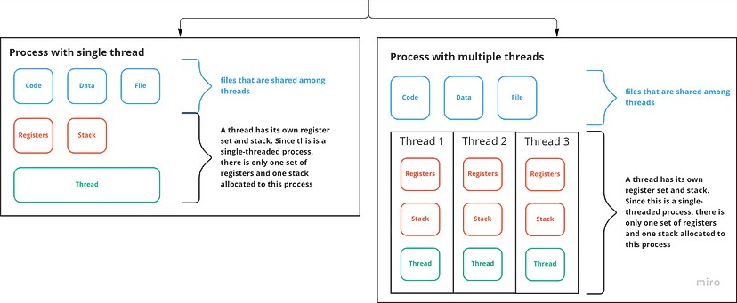

# System Design Roadmap

1. Foundation
    - Computer Science Basics
        - Big-O Notation & Time Complexity
        - Arrays, Stacks, Queue, Linked Lists, HashMaps
        - Trees & Graphs Traversal
        - Sorting Algo (Mergs, Quick)
        - Data Structure Trade-offs
    - Networking Essentials
        - HTTP/HTTPS, TCP/IP, UDP
        - DNS Resolution
        - TCP 3 Way Handshake
        - REST APIs and Status Codes
        - Latency, Throughput, Bandwidth
    - OS Concepts
        - [Threads vs Process](#threads-vs-process)
        - [CPU Scheduling](#cpu-scheduling)
        - [Context Switching](#context-switching)
        - I/O Blocking & Async I/O
        - Virtual Memory & Paging
        - File Systems & Storage
        - [Race Condition](#race-condition)
    - Database
        - Relational vs NoSQL Database
        - SQL Basics & Joins
2. Core System Design
    - Load Balancing & Scaling
        - Vertical vs Horizontal Scaling
        - L4 vs L7 Load Balancers
        - DNS Based Load Balancing
        - Health Checks & Failover
        - Consistent Hashing
    - Caching System
        - Importance of Caching
        - Redis & Memcached
        - Eviction Policies (LRU, FRU, FIFO)
        - Write Strategies (Write-through, Write-back)
    - Database Deep Dive
        - Sharding & Partitioning
        - Replication Models
        - Read/Write Replicas
        - CAP Theoram & Trade-offs
        - Consistency Models
            - Eventual Consistency
            - Strong Consistency
    - Queue & Messaging
        - Message Brokers (Kafka, RabbitMQ)
        - Sync vs Async Communication
        - Pub/Sub Model
        - Delivery Guarantees & Ordering
        - Dead Letter Queues & Retries
3. Practice & Real Systems
    - Design Thinking
        - Requirement Clarification
        - BottleNeck Identification
        - Data & Control Flow
        - Stateless vs Stateful
        - Failure Handling
    - Design Patterns
        - Rate Limiting (Token, leaky Bucket)
        - Circuite Breaker & Retry Logic
        - Leader Election
        - Health Checks & Heartbeats
        - CQRS & Event Sourcing
    - Practice Questions
        - Design URL Shortner
        - Design Chat App
        - Design Youtube System
        - Design Twitter Feed
        - E-Commerce Backend
    - Final Review & Reinforcement
        - Review All Design Concepts
        - Summarize Common BottleNecks
        - FlashCards / Notes ReCap
        - Revise Patterns & Architecture
        - Deep Dive on Weak Areas

## Threads vs Process

| **Process**                                                                 | **Thread**                                                                   |
|-----------------------------------------------------------------------------|------------------------------------------------------------------------------|
| System calls are involved in process (e.g., `fork()` is used to create a child process) | No system call is involved                                                   |
| OS treats different processes separately                                    | All user-level threads are treated as a single task by the OS                |
| Each process has its own copy of data, files, and code                      | Threads share the same copy of data, files, and code                         |
| Context switching is slower                                                 | Context switching is faster                                                  |
| Blocking a process does not block other processes or child processes        | Blocking a thread blocks the entire process                                 |
| Processes are independent                                                   | Threads are interdependent                                                   |

## 🧪 Example in Practice

### 🧩 Processes Example
When you open:

- **Chrome**
- **VS Code**
- **Terminal**

Each one runs in its **own process** with its **own memory and OS resources**.

---

### 🧩 Threads Example
Inside **Chrome**:

- One thread handles **rendering**
- Another handles **user input**
- Another handles **network requests**

## CPU Scheduling
**What is CPU Scheduling?**
CPU Scheduling is the process used by the operating system (OS) to decide which process or thread gets to use the CPU at any given time.

Since a CPU can typically execute only one task at a time per core, but there are usually many processes or threads waiting to run, the OS uses a CPU scheduler to manage this competition efficiently.

### ❓ Why Is It Important?

- Maximizes **CPU utilization**
- Improves **system responsiveness**
- Ensures **fairness** among tasks
- Supports **concurrent execution** (multitasking)
- Reduces **waiting time** and **turnaround time**

### CPU Scheduling Algos
### ⚙️ CPU Scheduling Algorithms

CPU scheduling algorithms are categorized into two main types based on whether a process can be forcibly removed from the CPU before it finishes.

---

#### ⏱️ Preemptive Scheduling

In **preemptive** scheduling, the OS can **interrupt and switch** the CPU from one process to another.

- **SRTF (Shortest Remaining Time First)**  
  The process with the shortest remaining burst time is executed next.

- **LRTF (Longest Remaining Time First)**  
  The process with the longest remaining burst time is executed next.

- **Round Robin**  
  Each process gets a fixed time slice (quantum); the CPU cycles through processes.

- **Priority Based (Preemptive)**  
  The CPU switches to a higher-priority process if it arrives during execution.

---

#### ⌛ Non-Preemptive Scheduling

In **non-preemptive** scheduling, once a process starts executing, it **runs to completion**.

- **FCFS (First Come First Served)**  
  Processes are executed in the order they arrive.

- **SJF (Shortest Job First)**  
  The process with the shortest total burst time is selected next.

- **LJF (Longest Job First)**  
  The process with the longest total burst time is selected next.

- **HRRN (Highest Response Ratio Next)**  
  Prioritizes based on response ratio:  
  \[ Response Ratio = (Waiting Time + Burst Time) / Burst Time \]

- **Multilevel Queue**  
  Processes are divided into multiple queues (e.g., system, user), each with its own scheduling strategy. No movement between queues.

---

### 🧪 Example: Preemptive vs Non-Preemptive Scheduling

Imagine a **single-core CPU** and 3 tasks arriving at the same time:

- **Task A**: needs 2 seconds  
- **Task B**: needs 1 second  
- **Task C**: needs 3 seconds

---

#### 🔸 Non-Preemptive Scheduling

In non-preemptive scheduling, once a task starts executing, it runs to completion.

- **FCFS (First-Come, First-Served)**  
  The CPU serves tasks in the order they arrive:  
  `Task A → Task B → Task C`

- **SJF (Shortest Job First)**  
  The CPU selects the task with the shortest **total burst time**:  
  `Task B → Task A → Task C`

- **LJF (Longest Job First)**  
  The CPU selects the task with the longest **total burst time**:  
  `Task C → Task A → Task B`

- **HRRN (Highest Response Ratio Next)**  
  Chooses the task with the highest response ratio. In this example, assuming same arrival times:  
  `Task B → Task A → Task C`

---

#### 🔹 Preemptive Scheduling

In preemptive scheduling, the CPU can switch tasks before completion based on criteria like remaining time or priority.

- **SRTF (Shortest Remaining Time First)**  
  The CPU always executes the task with the shortest **remaining time**.  
  Since all arrive together, it's the same as SJF:  
  `Task B → Task A → Task C`

- **LRTF (Longest Remaining Time First)**  
  The CPU always picks the task with the longest **remaining time**.  
  `Task C → Task A → Task B`

- **Round Robin (Quantum = 1 sec)**  
  Tasks are rotated with a fixed time slice:  
  `Task A (1s) → Task B (1s) → Task C (1s) → Task A (1s) → Task C (2s)`

- **Priority Based (Preemptive)**  
  If we assign priorities (e.g., B > A > C), the CPU runs:  
  `Task B → Task

## Context Switching
### 🔄 What is Context Switching?

**Context Switching** is the process by which the CPU **saves the state** of a currently running task (process or thread) and **restores the state** of the next task to be run.

This allows **multitasking** — enabling the CPU to switch between different processes or threads efficiently.

---

### 🧠 Why It Happens

- A higher-priority process needs to run
- The current process is waiting (e.g., for I/O)
- Time slice (quantum) expires in preemptive scheduling
- System interrupts or OS tasks take control

---

### 🧳 What Is Saved/Restored During Context Switch?

- Program counter (instruction pointer)
- CPU registers
- Stack pointers
- Memory management information
- Process state (e.g., ready, running, waiting)

---

### ⚠️ Overhead

Context switching introduces some **performance overhead** because:

- CPU cycles are spent saving/restoring states
- Cache memory may be invalidated
- Frequent switching can reduce overall efficiency

---

### 📌 Summary

> Context switching is essential for multitasking, but should be minimized when possible due to its overhead.

## Race Condition
### 🏃‍♂️ What is a Race Condition?

A **race condition** occurs when two or more threads or processes **access shared data concurrently**, and the final outcome depends on the **timing or sequence** of their execution.

Because the operations are not atomic or synchronized, this can lead to **unexpected or incorrect results**.

---

### 🔍 Why Does It Happen?

- Multiple threads/processes try to **read and write** shared variables at the same time.
- Lack of proper **synchronization mechanisms** (like locks, semaphores).
- Timing differences cause **interleaving** of operations.

---

### ⚠️ Example

Imagine two threads incrementing the same counter variable simultaneously:

1. Thread 1 reads counter = 5  
2. Thread 2 reads counter = 5  
3. Thread 1 increments to 6 and writes back  
4. Thread 2 increments to 6 and writes back  

Final counter value = 6 (instead of 7), losing one increment.

---

### 🛠️ How to Avoid Race Conditions

- Use **mutexes**, **locks**, or **semaphores** to synchronize access.
- Use **atomic operations** where available.
- Design algorithms to avoid shared state or minimize concurrency conflicts.

---

### 📌 Summary

> Race conditions cause unpredictable behavior in concurrent programs and must be carefully managed to ensure correctness.
