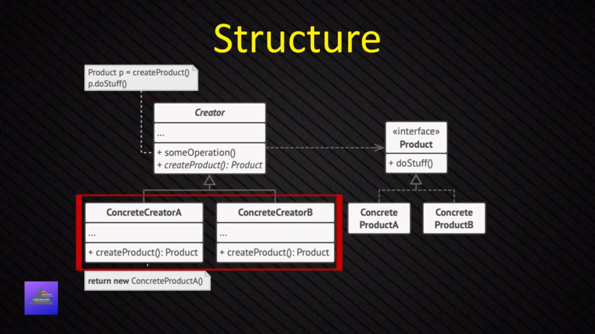
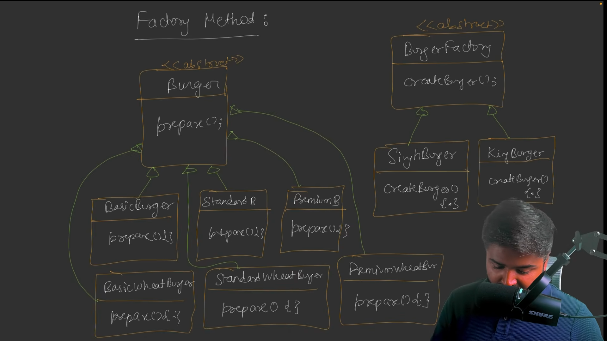
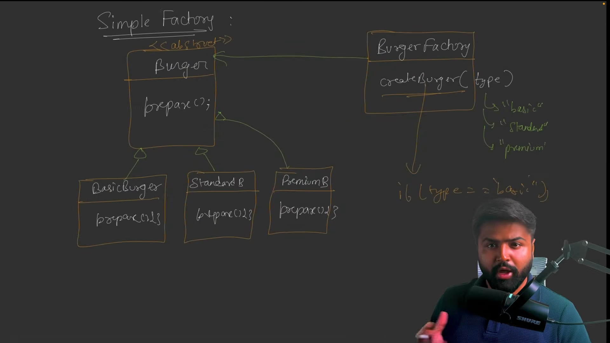
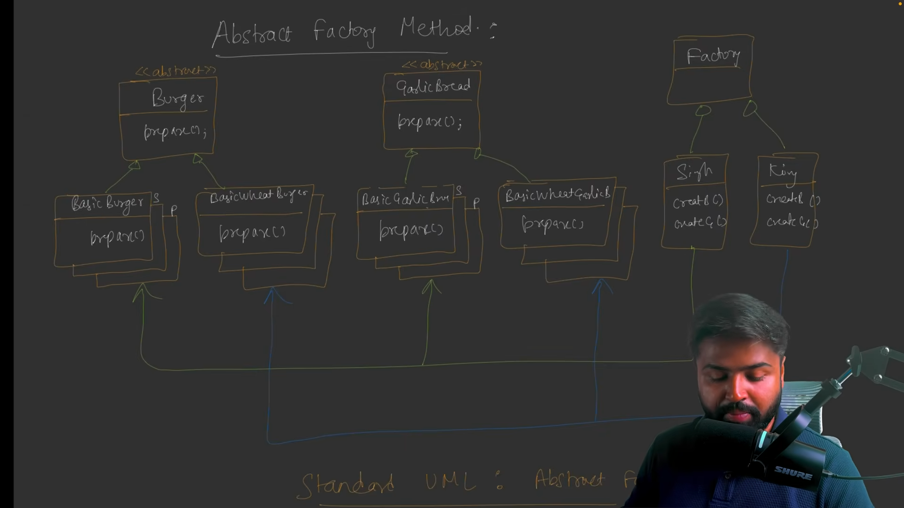

## Creation Design Pattern

- [Singleton Design Pattern](#singleton-design-pattern)
- [Factory Design Pattern](#factory-design-pattern)
- [Abstract Factory Design Pattern](#abstract-factory-design-pattern)
- [Builder Design Pattern](#builder-design-pattern)
- [Prototype Design Pattern](#prototype-design-pattern)

### Singleton Design Pattern

The **Singleton Pattern** is a creational design pattern that ensures a class has only one instance and provides a global point of access to that instance.

**Problem**
- Ensure that a class has just a single instance
- Provide a global access point to that instance

**Solution**
- Make default constructor private, to prevent other objects from using the new operator with the Singleton class.
- Create a static creation method that acts as a constructor.


---

#### TypeScript Implementation

```ts
class MySingleton {
  private static instance: MySingleton | null = null;
  private static readonly locker = {}; // Simple lock mechanism

  // Private constructor prevents direct instantiation
  private constructor() {}

  public static getInstance(): MySingleton {
    if (MySingleton.instance === null) {
      // Thread-safe implementation (simplified for TypeScript)
      if (MySingleton.instance === null) {
        MySingleton.instance = new MySingleton();
      }
    }
    return MySingleton.instance;
  }

  // Example method
  public doSomething(): void {
    console.log("Singleton instance is working!");
  }
}

// Usage
const instance1 = MySingleton.getInstance();
const instance2 = MySingleton.getInstance();

console.log(instance1 === instance2); // Output: true (same instance)
instance1.doSomething(); // Output: Singleton instance is working!
```

--- 
**How it Works**
- **Private Constructor**: Prevents direct instantiation with new MySingleton().
- **Static Instance**: Holds the single instance of the class.
- **Static Method**: getInstance() provides controlled access to the instance.
- **Lazy Initialization**: Instance is created only when first requested.
- **Thread Safety**: The double-check locking pattern prevents multiple instances in concurrent environments.

# When to Use Singleton

## ✅ Good for:
- Database connections  
- Logging systems  
- Configuration settings  
- Cache managers  
- Print spoolers  

## ❌ Avoid when:
- You need multiple instances  
- Testing becomes difficult  
- It introduces global state (can make code harder to test)  

> **Key Point:**  
> Singleton ensures one instance exists globally, but use it carefully as it can make code tightly coupled and harder to test.


# When to Identify Singleton Pattern

## ✅ Look for These Characteristics:
- Only one instance needed globally  
- Shared resource management (DB, files, hardware)  
- Global state or configuration  
- Centralized control point  
- Resource pooling or caching  
- Cross-cutting concerns (logging, monitoring)  
- Hardware device access  
- System-wide coordination  

## 💡 Common Naming Patterns:
- **Manager** (e.g., `CacheManager`, `SessionManager`)  
- **Service** (e.g., `LoggingService`, `ConfigService`)  
- **Pool** (e.g., `ConnectionPool`, `ThreadPool`)  
- **Registry** (e.g., `ServiceRegistry`)  
- **Controller** (e.g., `SystemController`)  

## ⚠️ Warning Signs:
- ❌ You need multiple instances  
- ❌ It makes testing difficult  
- ❌ It creates tight coupling  
- ❌ State changes frequently  
- ❌ Different configurations are needed  


**Real-World Scenarios**
1. Database Connection Manager

```js

class DatabaseManager {
  private static instance: DatabaseManager;
  private connection: string;

  private constructor() {
    this.connection = "Connected to Database";
  }

  public static getInstance(): DatabaseManager {
    if (!DatabaseManager.instance) {
      DatabaseManager.instance = new DatabaseManager();
    }
    return DatabaseManager.instance;
  }

  public query(sql: string): void {
    console.log(`Executing: ${sql}`);
  }
}

// All parts of application use same database connection
const db1 = DatabaseManager.getInstance();
const db2 = DatabaseManager.getInstance();
console.log(db1 === db2); // true - same instance
```
2. Logger System
```js
class Logger {
  private static instance: Logger;

  private constructor() {}

  public static getInstance(): Logger {
    if (!Logger.instance) {
      Logger.instance = new Logger();
    }
    return Logger.instance;
  }

  public log(message: string): void {
    console.log(`[${new Date().toISOString()}] ${message}`);
  }
}

// Same logger instance used throughout application
const logger1 = Logger.getInstance();
const logger2 = Logger.getInstance();
logger1.log("Application started"); // Both reference same logger

```

3. Configuration Manager

```js
class ConfigManager {
  private static instance: ConfigManager;
  private config: { [key: string]: string } = {};

  private constructor() {
    // Load configuration from file/environment
    this.config = {
      apiUrl: "https://api.example.com",
      timeout: "5000"
    };
  }

  public static getInstance(): ConfigManager {
    if (!ConfigManager.instance) {
      ConfigManager.instance = new ConfigManager();
    }
    return ConfigManager.instance;
  }

  public get(key: string): string {
    return this.config[key];
  }
}

// Same configuration accessed everywhere
const config1 = ConfigManager.getInstance();
const config2 = ConfigManager.getInstance();
console.log(config1.get("apiUrl")); // Same config data

```
4. Print Spooler
```js
class PrintSpooler {
  private static instance: PrintSpooler;
  private queue: string[] = [];

  private constructor() {}

  public static getInstance(): PrintSpooler {
    if (!PrintSpooler.instance) {
      PrintSpooler.instance = new PrintSpooler();
    }
    return PrintSpooler.instance;
  }

  public addJob(document: string): void {
    this.queue.push(document);
    console.log(`Added to print queue: ${document}`);
  }

  public printNext(): void {
    const job = this.queue.shift();
    if (job) {
      console.log(`Printing: ${job}`);
    }
  }
}

// All print requests go through same spooler
const spooler1 = PrintSpooler.getInstance();
const spooler2 = PrintSpooler.getInstance();
spooler1.addJob("Document1.pdf");
spooler2.printNext(); // Same queue, same instance
```
---

1. Application Settings/Configuration Manager

```ts
class AppConfig {
  private static instance: AppConfig;
  private settings: Map<string, any> = new Map();

  private constructor() {
    this.loadSettings();
  }

  public static getInstance(): AppConfig {
    if (!AppConfig.instance) {
      AppConfig.instance = new AppConfig();
    }
    return AppConfig.instance;
  }

  private loadSettings(): void {
    // Load from config file, environment variables, etc.
    this.settings.set('theme', 'dark');
    this.settings.set('language', 'en');
  }

  public getSetting(key: string): any {
    return this.settings.get(key);
  }
}
```

2. Database Connection Pool
```ts
class DatabasePool {
  private static instance: DatabasePool;
  private connections: Connection[] = [];
  private maxConnections = 10;

  private constructor() {
    this.initializePool();
  }

  public static getInstance(): DatabasePool {
    if (!DatabasePool.instance) {
      DatabasePool.instance = new DatabasePool();
    }
    return DatabasePool.instance;
  }

  public getConnection(): Connection {
    return this.connections.pop() || this.createNewConnection();
  }

  public releaseConnection(conn: Connection): void {
    this.connections.push(conn);
  }
}
```

3. Cache Manager
```ts
class CacheManager {
  private static instance: CacheManager;
  private cache: Map<string, any> = new Map();

  private constructor() {}

  public static getInstance(): CacheManager {
    if (!CacheManager.instance) {
      CacheManager.instance = new CacheManager();
    }
    return CacheManager.instance;
  }

  public set(key: string, value: any, ttl: number = 3600): void {
    this.cache.set(key, { value, expiry: Date.now() + ttl * 1000 });
  }

  public get(key: string): any {
    const item = this.cache.get(key);
    if (item && item.expiry > Date.now()) {
      return item.value;
    }
    this.cache.delete(key);
    return null;
  }
}
```

4. System Logger
```ts
class SystemLogger {
  private static instance: SystemLogger;
  private logFile: string = 'system.log';

  private constructor() {}

  public static getInstance(): SystemLogger {
    if (!SystemLogger.instance) {
      SystemLogger.instance = new SystemLogger();
    }
    return SystemLogger.instance;
  }

  public info(message: string): void {
    this.writeToFile(`[INFO] ${new Date().toISOString()}: ${message}`);
  }

  public error(message: string): void {
    this.writeToFile(`[ERROR] ${new Date().toISOString()}: ${message}`);
  }

  private writeToFile(message: string): void {
    // Write to file system
    console.log(message);
  }
}
```

5. Thread Pool Manager
```ts
class ThreadPoolManager {
  private static instance: ThreadPoolManager;
  private workers: Worker[] = [];
  private maxThreads = 4;

  private constructor() {
    this.initializeThreads();
  }

  public static getInstance(): ThreadPoolManager {
    if (!ThreadPoolManager.instance) {
      ThreadPoolManager.instance = new ThreadPoolManager();
    }
    return ThreadPoolManager.instance;
  }

  public executeTask(task: Function): void {
    const availableWorker = this.getAvailableWorker();
    availableWorker.execute(task);
  }

  private getAvailableWorker(): Worker {
    return this.workers.find(w => w.isIdle()) || this.workers[0];
  }
}
```

6. Hardware Device Manager (Printer / Scanner)
```ts
class PrinterManager {
  private static instance: PrinterManager;
  private isConnected: boolean = false;
  private printQueue: string[] = [];

  private constructor() {
    this.connectToPrinter();
  }

  public static getInstance(): PrinterManager {
    if (!PrinterManager.instance) {
      PrinterManager.instance = new PrinterManager();
    }
    return PrinterManager.instance;
  }

  public print(document: string): void {
    if (this.isConnected) {
      this.printQueue.push(document);
      console.log(`Printing: ${document}`);
    } else {
      console.log('Printer not connected');
    }
  }

  private connectToPrinter(): void {
    this.isConnected = true;
  }
}
```

7. API Rate Limiter
```ts
class RateLimiter {
  private static instance: RateLimiter;
  private requests: Map<string, number[]> = new Map();
  private maxRequests = 100;
  private timeWindow = 3600000; // 1 hour

  private constructor() {}

  public static getInstance(): RateLimiter {
    if (!RateLimiter.instance) {
      RateLimiter.instance = new RateLimiter();
    }
    return RateLimiter.instance;
  }

  public isAllowed(clientId: string): boolean {
    const now = Date.now();
    const clientRequests = this.requests.get(clientId) || [];
    
    // Remove old requests
    const validRequests = clientRequests.filter(time => now - time < this.timeWindow);
    
    if (validRequests.length < this.maxRequests) {
      validRequests.push(now);
      this.requests.set(clientId, validRequests);
      return true;
    }
    
    return false;
  }
}
```

8. Event Bus/Message Broker
```ts
class EventBus {
  private static instance: EventBus;
  private listeners: Map<string, Function[]> = new Map();

  private constructor() {}

  public static getInstance(): EventBus {
    if (!EventBus.instance) {
      EventBus.instance = new EventBus();
    }
    return EventBus.instance;
  }

  public subscribe(event: string, callback: Function): void {
    if (!this.listeners.has(event)) {
      this.listeners.set(event, []);
    }
    this.listeners.get(event)!.push(callback);
  }

  public publish(event: string, data: any): void {
    const callbacks = this.listeners.get(event) || [];
    callbacks.forEach(callback => callback(data));
  }
}
```

9. Session Manager
```ts

class SessionManager {
  private static instance: SessionManager;
  private sessions: Map<string, SessionData> = new Map();

  private constructor() {}

  public static getInstance(): SessionManager {
    if (!SessionManager.instance) {
      SessionManager.instance = new SessionManager();
    }
    return SessionManager.instance;
  }

  public createSession(userId: string): string {
    const sessionId = this.generateSessionId();
    this.sessions.set(sessionId, {
      userId,
      createdAt: Date.now(),
      lastAccessed: Date.now()
    });
    return sessionId;
  }

  public getSession(sessionId: string): SessionData | null {
    const session = this.sessions.get(sessionId);
    if (session) {
      session.lastAccessed = Date.now();
      return session;
    }
    return null;
  }

  private generateSessionId(): string {
    return Math.random().toString(36).substr(2, 9);
  }
}

```

10. Application State Manager
```ts

class AppStateManager {
  private static instance: AppStateManager;
  private state: any = {};
  private observers: Function[] = [];

  private constructor() {}

  public static getInstance(): AppStateManager {
    if (!AppStateManager.instance) {
      AppStateManager.instance = new AppStateManager();
    }
    return AppStateManager.instance;
  }

  public setState(key: string, value: any): void {
    this.state[key] = value;
    this.notifyObservers();
  }

  public getState(key: string): any {
    return this.state[key];
  }

  public subscribe(observer: Function): void {
    this.observers.push(observer);
  }
  public unsubscribe(observer: Function): void {
    this.observers.delete(observer);
  }

  private notifyObservers(): void {
    this.observers.forEach(observer => observer(this.state));
  }

  private debouncedNotify(delay = 100): void {
    clearTimeout(this.notifyTimeout);
    this.notifyTimeout = setTimeout(() => {
      this.notifyObservers();
    }, delay);
  }

}

```

--- 

### Factory Design Pattern

The **Factory Pattern** is a creational design pattern that provides an interface for creating objects in a superclass, but allows subclasses to alter the type of objects that will be created. 

It encapsulates object creation logic and promotes loose coupling between the client and the objects being created.



**Simple Factory : A Factory class that decides which concrete class to instantiate.**



**Factory Method : Defines an interface for creating objects but allows subclasses to decide which class to instantiate.**





**Abstract Factory : Provides an interface for creating families of related objects without specifying there concrete classes.**


---

### TypeScript Implementation
**Simple Factory typescript Code**

```ts

// --- Burger Interface ---
interface Burger {
    prepare(): void;
}

// --- Concrete Burger Implementations ---
class BasicBurger implements Burger {    
    prepare(): void {
        console.log("Preparing Basic Burger with bun, patty, and ketchup!");
    }
}

class StandardBurger implements Burger {
    prepare(): void {
        console.log("Preparing Standard Burger with bun, patty, cheese, and lettuce!");
    }
}

class PremiumBurger implements Burger {
    prepare(): void {
        console.log("Preparing Premium Burger with gourmet bun, premium patty, cheese, lettuce, and secret sauce!");
    }
}

// --- Burger Factory ---
class BurgerFactory {
    createBurger(String type): Burger {
        switch(type){
            case 'basic':
                return new BasicBurger();
                break;
            case 'standard':
                return new StandardBurger();
                break;
            case 'premium':
                return new PremiumBurger()
                brea;
            default:
                console.log("Invalid burger type!");
                return null;
        }
    }
}


// --- Usage ---
const type = "standard";
const factory = new BurgerFactory();
const burger = factory.createBurger(type);

if (burger) {
    burger.prepare(); // ✅ Will call the appropriate burger's prepare() method
}

```

**Factory Design Method Typescript Code**

```ts
// --- Product Interface and Implementations ---
interface Burger {
    prepare(): void;
}

// Regular Buns
class BasicBurger implements Burger {
    prepare(): void {
        console.log("Preparing Basic Burger with bun, patty, and ketchup!");
    }
}

class StandardBurger implements Burger {
    prepare(): void {
        console.log("Preparing Standard Burger with bun, patty, cheese, and lettuce!");
    }
}

class PremiumBurger implements Burger {
    prepare(): void {
        console.log("Preparing Premium Burger with gourmet bun, premium patty, cheese, lettuce, and secret sauce!");
    }
}

// Wheat Buns
class BasicWheatBurger implements Burger {
    prepare(): void {
        console.log("Preparing Basic Wheat Burger with bun, patty, and ketchup!");
    }
}

class StandardWheatBurger implements Burger {
    prepare(): void {
        console.log("Preparing Standard Wheat Burger with bun, patty, cheese, and lettuce!");
    }
}

class PremiumWheatBurger implements Burger {
    prepare(): void {
        console.log("Preparing Premium Wheat Burger with gourmet bun, premium patty, cheese, lettuce, and secret sauce!");
    }
}

// --- Factory Interface and Concrete Factories ---
interface BurgerFactory {
    createBurger(type: string): Burger | null;
}

class SinghBurger implements BurgerFactory {
    createBurger(type: string): Burger | null {
        switch (type.toLowerCase()) {
            case "basic":
                return new BasicBurger();
            case "standard":
                return new StandardBurger();
            case "premium":
                return new PremiumBurger();
            default:
                console.log("❌ Invalid burger type!");
                return null;
        }
    }
}

class KingBurger implements BurgerFactory {
    createBurger(type: string): Burger | null {
        switch (type.toLowerCase()) {
            case "basic":
                return new BasicWheatBurger();
            case "standard":
                return new StandardWheatBurger();
            case "premium":
                return new PremiumWheatBurger();
            default:
                console.log("❌ Invalid burger type!");
                return null;
        }
    }
}

// --- Main / Usage Example ---
function main() {
    const type = "basic";

    const myFactory: BurgerFactory = new SinghBurger(); // or new KingBurger()
    const burger = myFactory.createBurger(type);

    if (burger) {
        burger.prepare();
    }
}

main();

```

**Abstract Factory Design Pattern Typescript Code**

```ts
// --- Product 1 --> Burger ---
interface Burger {
    prepare(): void;
}

class BasicBurger implements Burger {
    prepare(): void {
        console.log("Preparing Basic Burger with bun, patty, and ketchup!");
    }
}

class StandardBurger implements Burger {
    prepare(): void {
        console.log("Preparing Standard Burger with bun, patty, cheese, and lettuce!");
    }
}

class PremiumBurger implements Burger {
    prepare(): void {
        console.log("Preparing Premium Burger with gourmet bun, premium patty, cheese, lettuce, and secret sauce!");
    }
}

class BasicWheatBurger implements Burger {
    prepare(): void {
        console.log("Preparing Basic Wheat Burger with bun, patty, and ketchup!");
    }
}

class StandardWheatBurger implements Burger {
    prepare(): void {
        console.log("Preparing Standard Wheat Burger with bun, patty, cheese, and lettuce!");
    }
}

class PremiumWheatBurger implements Burger {
    prepare(): void {
        console.log("Preparing Premium Wheat Burger with gourmet bun, premium patty, cheese, lettuce, and secret sauce!");
    }
}

// --- Product 2 --> GarlicBread ---
interface GarlicBread {
    prepare(): void;
}

class BasicGarlicBread implements GarlicBread {
    prepare(): void {
        console.log("Preparing Basic Garlic Bread with butter and garlic!");
    }
}

class CheeseGarlicBread implements GarlicBread {
    prepare(): void {
        console.log("Preparing Cheese Garlic Bread with extra cheese and butter!");
    }
}

class BasicWheatGarlicBread implements GarlicBread {
    prepare(): void {
        console.log("Preparing Basic Wheat Garlic Bread with butter and garlic!");
    }
}

class CheeseWheatGarlicBread implements GarlicBread {
    prepare(): void {
        console.log("Preparing Cheese Wheat Garlic Bread with extra cheese and butter!");
    }
}

// --- Abstract Factory ---
interface MealFactory {
    createBurger(type: string): Burger | null;
    createGarlicBread(type: string): GarlicBread | null;
}

// --- Concrete Factory 1 ---
class SinghBurger implements MealFactory {
    createBurger(type: string): Burger | null {
        switch (type.toLowerCase()) {
            case "basic":
                return new BasicBurger();
            case "standard":
                return new StandardBurger();
            case "premium":
                return new PremiumBurger();
            default:
                console.log("❌ Invalid burger type!");
                return null;
        }
    }

    createGarlicBread(type: string): GarlicBread | null {
        switch (type.toLowerCase()) {
            case "basic":
                return new BasicGarlicBread();
            case "cheese":
                return new CheeseGarlicBread();
            default:
                console.log("❌ Invalid garlic bread type!");
                return null;
        }
    }
}

// --- Concrete Factory 2 ---
class KingBurger implements MealFactory {
    createBurger(type: string): Burger | null {
        switch (type.toLowerCase()) {
            case "basic":
                return new BasicWheatBurger();
            case "standard":
                return new StandardWheatBurger();
            case "premium":
                return new PremiumWheatBurger();
            default:
                console.log("❌ Invalid burger type!");
                return null;
        }
    }

    createGarlicBread(type: string): GarlicBread | null {
        switch (type.toLowerCase()) {
            case "basic":
                return new BasicWheatGarlicBread();
            case "cheese":
                return new CheeseWheatGarlicBread();
            default:
                console.log("❌ Invalid garlic bread type!");
                return null;
        }
    }
}

// --- Main / Usage ---
function main() {
    const burgerType = "basic";
    const garlicBreadType = "cheese";

    const mealFactory: MealFactory = new SinghBurger(); // or new KingBurger()

    const burger = mealFactory.createBurger(burgerType);
    const garlicBread = mealFactory.createGarlicBread(garlicBreadType);

    if (burger) burger.prepare();
    if (garlicBread) garlicBread.prepare();
}

main();

```

```ts
// IProduct interface
interface IPizza {
  eat(): string;
}

// ConcreteProduct1
class VegPizza implements IPizza {
  eat(): string {
    return "Eating Veg Pizza";
  }
}

// ConcreteProduct2
class NonVegPizza implements IPizza {
  eat(): string {
    return "Eating Non-Veg Pizza";
  }
}

// IFactory interface
interface IPizzaChef {
  preparePizza(): IPizza;
}

// ConcreteFactory1
class VegPizzaChef implements IPizzaChef {
  preparePizza(): IPizza {
    return new VegPizza();
  }
}

// ConcreteFactory2
class NonVegPizzaChef implements IPizzaChef {
  preparePizza(): IPizza {
    return new NonVegPizza();
  }
}

// Client
class Waiter {
  getPizza(pizzaType: string): IPizza {
    let chef: IPizzaChef;
    
    switch (pizzaType) {
      case "NonVeg":
        chef = new NonVegPizzaChef();
        break;
      default:
        chef = new VegPizzaChef();
        break;
    }
    
    return chef.preparePizza();
  }
}

// Usage
const waiter = new Waiter();
const vegPizza = waiter.getPizza("Veg");
const nonVegPizza = waiter.getPizza("NonVeg");

console.log(vegPizza.eat());    // Output: Eating Veg Pizza
console.log(nonVegPizza.eat()); // Output: Eating Non-Veg Pizza

```


# How Factory Pattern Works

## 🏗️ Components of the Factory Pattern

- **Factory Interface (`IPizzaChef`)**: Defines the method for creating objects  
- **Concrete Factories (`VegPizzaChef`, `NonVegPizzaChef`)**: Implement the creation logic  
- **Product Interface (`IPizza`)**: Defines the interface for created objects  
- **Concrete Products (`VegPizza`, `NonVegPizza`)**: Actual objects being created  
- **Client (`Waiter`)**: Uses the factory to create objects without knowing their concrete types  

---

# When to Identify Factory Pattern

## ✅ Look for These Characteristics:
- Object creation logic is complex or varies  
- Need to create different types of objects based on conditions  
- Want to decouple object creation from usage  
- Multiple classes implement the same interface  
- Creation logic might change frequently  

---

## 💡 Common Naming Patterns:
- **Factory** (e.g., `PizzaFactory`, `CarFactory`)  
- **Creator** (e.g., `DocumentCreator`, `ShapeCreator`)  
- **Builder** (e.g., `MessageBuilder`, `QueryBuilder`)  
- **Provider** (e.g., `DatabaseProvider`, `ServiceProvider`)  
- **Generator** (e.g., `ReportGenerator`, `TokenGenerator`)  

---

## ⚠️ Warning Signs:
- ❌ Simple object creation (use `new` instead)  
- ❌ Only one type of object to create  
- ❌ Creation logic never changes  
- ❌ Over-engineering simple scenarios  

---

## ✅ Factory Pattern is Good For:
- Creating objects with complex initialization  
- Hiding object creation complexity from clients  
- Supporting multiple product families  
- Implementing plugin architectures  
- Database connection creation  
- File format parsers  
- UI component creation  

**10 Real-World Scenarios**
1. Database Connection Factory

```ts
interface IConnection {
  connect(): string;
  query(sql: string): any[];
}

class MySQLConnection implements IConnection {
  connect(): string { return "Connected to MySQL"; }
  query(sql: string): any[] { return []; }
}

class PostgreSQLConnection implements IConnection {
  connect(): string { return "Connected to PostgreSQL"; }
  query(sql: string): any[] { return []; }
}

interface IConnectionFactory {
  createConnection(): IConnection;
}

class MySQLFactory implements IConnectionFactory {
  createConnection(): IConnection {
    return new MySQLConnection();
  }
}

class PostgreSQLFactory implements IConnectionFactory {
  createConnection(): IConnection {
    return new PostgreSQLConnection();
  }
}

class DatabaseManager {
  getConnection(dbType: string): IConnection {
    let factory: IConnectionFactory;
    
    switch (dbType) {
      case "mysql":
        factory = new MySQLFactory();
        break;
      case "postgresql":
        factory = new PostgreSQLFactory();
        break;
      default:
        throw new Error("Unsupported database type");
    }
    
    return factory.createConnection();
  }
}
```

2. Payment Gateway Factory
```ts
interface IPaymentGateway {
  processPayment(amount: number): string;
}

class PayPalGateway implements IPaymentGateway {
  processPayment(amount: number): string {
    return `Processed $${amount} via PayPal`;
  }
}

class StripeGateway implements IPaymentGateway {
  processPayment(amount: number): string {
    return `Processed $${amount} via Stripe`;
  }
}

interface IPaymentFactory {
  createGateway(): IPaymentGateway;
}

class PayPalFactory implements IPaymentFactory {
  createGateway(): IPaymentGateway {
    return new PayPalGateway();
  }
}

class StripeFactory implements IPaymentFactory {
  createGateway(): IPaymentGateway {
    return new StripeGateway();
  }
}

class PaymentProcessor {
  processPayment(gatewayType: string, amount: number): string {
    let factory: IPaymentFactory;
    
    switch (gatewayType) {
      case "paypal":
        factory = new PayPalFactory();
        break;
      case "stripe":
        factory = new StripeFactory();
        break;
      default:
        throw new Error("Unsupported payment gateway");
    }
    
    const gateway = factory.createGateway();
    return gateway.processPayment(amount);
  }
}
```

3. Document Parser Factory

```ts
interface IDocumentParser {
  parse(content: string): any;
}

class PDFParser implements IDocumentParser {
  parse(content: string): any {
    return { type: "PDF", data: content };
  }
}

class XMLParser implements IDocumentParser {
  parse(content: string): any {
    return { type: "XML", data: content };
  }
}

class JSONParser implements IDocumentParser {
  parse(content: string): any {
    return { type: "JSON", data: JSON.parse(content) };
  }
}

interface IParserFactory {
  createParser(): IDocumentParser;
}

class PDFParserFactory implements IParserFactory {
  createParser(): IDocumentParser {
    return new PDFParser();
  }
}

class XMLParserFactory implements IParserFactory {
  createParser(): IDocumentParser {
    return new XMLParser();
  }
}

class JSONParserFactory implements IParserFactory {
  createParser(): IDocumentParser {
    return new JSONParser();
  }
}

class DocumentProcessor {
  parseDocument(fileExtension: string, content: string): any {
    let factory: IParserFactory;
    
    switch (fileExtension.toLowerCase()) {
      case "pdf":
        factory = new PDFParserFactory();
        break;
      case "xml":
        factory = new XMLParserFactory();
        break;
      case "json":
        factory = new JSONParserFactory();
        break;
      default:
        throw new Error("Unsupported file format");
    }
    
    const parser = factory.createParser();
    return parser.parse(content);
  }
}
```

4. UI Component Factory

```ts
interface IButton {
  render(): string;
  onClick(): void;
}

class WindowsButton implements IButton {
  render(): string { return "Windows Button"; }
  onClick(): void { console.log("Windows button clicked"); }
}

class MacButton implements IButton {
  render(): string { return "Mac Button"; }
  onClick(): void { console.log("Mac button clicked"); }
}

class LinuxButton implements IButton {
  render(): string { return "Linux Button"; }
  onClick(): void { console.log("Linux button clicked"); }
}

interface IUIFactory {
  createButton(): IButton;
}

class WindowsUIFactory implements IUIFactory {
  createButton(): IButton {
    return new WindowsButton();
  }
}

class MacUIFactory implements IUIFactory {
  createButton(): IButton {
    return new MacButton();
  }
}

class LinuxUIFactory implements IUIFactory {
  createButton(): IButton {
    return new LinuxButton();
  }
}

class UIManager {
  createUI(platform: string): IButton {
    let factory: IUIFactory;
    
    switch (platform) {
      case "windows":
        factory = new WindowsUIFactory();
        break;
      case "mac":
        factory = new MacUIFactory();
        break;
      case "linux":
        factory = new LinuxUIFactory();
        break;
      default:
        throw new Error("Unsupported platform");
    }
    
    return factory.createButton();
  }
}
```

5. Notification Service Factory
```ts
interface INotification {
  send(message: string): string;
}

class EmailNotification implements INotification {
  send(message: string): string {
    return `Email sent: ${message}`;
  }
}

class SMSNotification implements INotification {
  send(message: string): string {
    return `SMS sent: ${message}`;
  }
}

class PushNotification implements INotification {
  send(message: string): string {
    return `Push notification sent: ${message}`;
  }
}

interface INotificationFactory {
  createNotification(): INotification;
}

class EmailNotificationFactory implements INotificationFactory {
  createNotification(): INotification {
    return new EmailNotification();
  }
}

class SMSNotificationFactory implements INotificationFactory {
  createNotification(): INotification {
    return new SMSNotification();
  }
}

class PushNotificationFactory implements INotificationFactory {
  createNotification(): INotification {
    return new PushNotification();
  }
}

class NotificationService {
  sendNotification(type: string, message: string): string {
    let factory: INotificationFactory;
    
    switch (type) {
      case "email":
        factory = new EmailNotificationFactory();
        break;
      case "sms":
        factory = new SMSNotificationFactory();
        break;
      case "push":
        factory = new PushNotificationFactory();
        break;
      default:
        throw new Error("Unsupported notification type");
    }
    
    const notification = factory.createNotification();
    return notification.send(message);
  }
}
```

6. Vehicle Factory
```ts

interface IVehicle {
  start(): string;
  stop(): string;
}

class Car implements IVehicle {
  start(): string { return "Car engine started"; }
  stop(): string { return "Car engine stopped"; }
}

class Motorcycle implements IVehicle {
  start(): string { return "Motorcycle engine started"; }
  stop(): string { return "Motorcycle engine stopped"; }
}

class Truck implements IVehicle {
  start(): string { return "Truck engine started"; }
  stop(): string { return "Truck engine stopped"; }
}

interface IVehicleFactory {
  createVehicle(): IVehicle;
}

class CarFactory implements IVehicleFactory {
  createVehicle(): IVehicle {
    return new Car();
  }
}

class MotorcycleFactory implements IVehicleFactory {
  createVehicle(): IVehicle {
    return new Motorcycle();
  }
}

class TruckFactory implements IVehicleFactory {
  createVehicle(): IVehicle {
    return new Truck();
  }
}

class VehicleDealer {
  getVehicle(type: string): IVehicle {
    let factory: IVehicleFactory;
    
    switch (type) {
      case "car":
        factory = new CarFactory();
        break;
      case "motorcycle":
        factory = new MotorcycleFactory();
        break;
      case "truck":
        factory = new TruckFactory();
        break;
      default:
        throw new Error("Unsupported vehicle type");
    }
    
    return factory.createVehicle();
  }
}

```

7. Logger Factory
```ts
interface ILogger {
  log(message: string): void;
}

class FileLogger implements ILogger {
  log(message: string): void {
    console.log(`[FILE] ${new Date().toISOString()}: ${message}`);
  }
}

class ConsoleLogger implements ILogger {
  log(message: string): void {
    console.log(`[CONSOLE] ${new Date().toISOString()}: ${message}`);
  }
}

class DatabaseLogger implements ILogger {
  log(message: string): void {
    console.log(`[DATABASE] ${new Date().toISOString()}: ${message}`);
  }
}

interface ILoggerFactory {
  createLogger(): ILogger;
}

class FileLoggerFactory implements ILoggerFactory {
  createLogger(): ILogger {
    return new FileLogger();
  }
}

class ConsoleLoggerFactory implements ILoggerFactory {
  createLogger(): ILogger {
    return new ConsoleLogger();
  }
}

class DatabaseLoggerFactory implements ILoggerFactory {
  createLogger(): ILogger {
    return new DatabaseLogger();
  }
}

class LoggingService {
  getLogger(type: string): ILogger {
    let factory: ILoggerFactory;
    
    switch (type) {
      case "file":
        factory = new FileLoggerFactory();
        break;
      case "console":
        factory = new ConsoleLoggerFactory();
        break;
      case "database":
        factory = new DatabaseLoggerFactory();
        break;
      default:
        throw new Error("Unsupported logger type");
    }
    
    return factory.createLogger();
  }
}
```

8. Image Processor Factory

```ts
interface IImageProcessor {
  process(imagePath: string): string;
}

class JPEGProcessor implements IImageProcessor {
  process(imagePath: string): string {
    return `Processing JPEG image: ${imagePath}`;
  }
}

class PNGProcessor implements IImageProcessor {
  process(imagePath: string): string {
    return `Processing PNG image: ${imagePath}`;
  }
}

class GIFProcessor implements IImageProcessor {
  process(imagePath: string): string {
    return `Processing GIF image: ${imagePath}`;
  }
}

interface IImageProcessorFactory {
  createProcessor(): IImageProcessor;
}

class JPEGProcessorFactory implements IImageProcessorFactory {
  createProcessor(): IImageProcessor {
    return new JPEGProcessor();
  }
}

class PNGProcessorFactory implements IImageProcessorFactory {
  createProcessor(): IImageProcessor {
    return new PNGProcessor();
  }
}

class GIFProcessorFactory implements IImageProcessorFactory {
  createProcessor(): IImageProcessor {
    return new GIFProcessor();
  }
}

class ImageService {
  processImage(fileExtension: string, imagePath: string): string {
    let factory: IImageProcessorFactory;
    
    switch (fileExtension.toLowerCase()) {
      case "jpg":
      case "jpeg":
        factory = new JPEGProcessorFactory();
        break;
      case "png":
        factory = new PNGProcessorFactory();
        break;
      case "gif":
        factory = new GIFProcessorFactory();
        break;
      default:
        throw new Error("Unsupported image format");
    }
    
    const processor = factory.createProcessor();
    return processor.process(imagePath);
  }
}
```
9. Report Generator Factory

```ts
interface IReport {
  generate(data: any[]): string;
}

class PDFReport implements IReport {
  generate(data: any[]): string {
    return `PDF Report generated with ${data.length} records`;
  }
}

class ExcelReport implements IReport {
  generate(data: any[]): string {
    return `Excel Report generated with ${data.length} records`;
  }
}

class CSVReport implements IReport {
  generate(data: any[]): string {
    return `CSV Report generated with ${data.length} records`;
  }
}

interface IReportFactory {
  createReport(): IReport;
}

class PDFReportFactory implements IReportFactory {
  createReport(): IReport {
    return new PDFReport();
  }
}

class ExcelReportFactory implements IReportFactory {
  createReport(): IReport {
    return new ExcelReport();
  }
}

class CSVReportFactory implements IReportFactory {
  createReport(): IReport {
    return new CSVReport();
  }
}

class ReportService {
  generateReport(format: string, data: any[]): string {
    let factory: IReportFactory;
    
    switch (format.toLowerCase()) {
      case "pdf":
        factory = new PDFReportFactory();
        break;
      case "excel":
        factory = new ExcelReportFactory();
        break;
      case "csv":
        factory = new CSVReportFactory();
        break;
      default:
        throw new Error("Unsupported report format");
    }
    
    const report = factory.createReport();
    return report.generate(data);
  }
}
```

10. Cache Provider Factory

```ts
interface ICacheProvider {
  get(key: string): any;
  set(key: string, value: any): void;
}

class MemoryCache implements ICacheProvider {
  private cache = new Map<string, any>();
  
  get(key: string): any {
    return this.cache.get(key);
  }
  
  set(key: string, value: any): void {
    this.cache.set(key, value);
  }
}

class RedisCache implements ICacheProvider {
  get(key: string): any {
    console.log(`Getting ${key} from Redis`);
    return null; // Simulate Redis get
  }
  
  set(key: string, value: any): void {
    console.log(`Setting ${key} in Redis with value:`, value);
  }
}

class FileCache implements ICacheProvider {
  get(key: string): any {
    console.log(`Getting ${key} from file system`);
    return null; // Simulate file read
  }
  
  set(key: string, value: any): void {
    console.log(`Writing ${key} to file system with value:`, value);
  }
}

interface ICacheFactory {
  createCache(): ICacheProvider;
}

class MemoryCacheFactory implements ICacheFactory {
  createCache(): ICacheProvider {
    return new MemoryCache();
  }
}

class RedisCacheFactory implements ICacheFactory {
  createCache(): ICacheProvider {
    return new RedisCache();
  }
}

class FileCacheFactory implements ICacheFactory {
  createCache(): ICacheProvider {
    return new FileCache();
  }
}

class CacheManager {
  getCache(type: string): ICacheProvider {
    let factory: ICacheFactory;
    
    switch (type.toLowerCase()) {
      case "memory":
        factory = new MemoryCacheFactory();
        break;
      case "redis":
        factory = new RedisCacheFactory();
        break;
      case "file":
        factory = new FileCacheFactory();
        break;
      default:
        throw new Error("Unsupported cache type");
    }
    
    return factory.createCache();
  }
}
```

# Summary

The **Factory Pattern** is essential when you need to:

- Create objects without specifying their exact classes  
- Delegate object creation to specialized factories  
- Support multiple product families  
- Make your code more flexible and maintainable  

---

## ✅ Key Benefits:

- Promotes **loose coupling**  
- Easier to **extend with new products**  
- **Centralizes** object creation logic  
- Follows the **Open/Closed Principle**  

---
