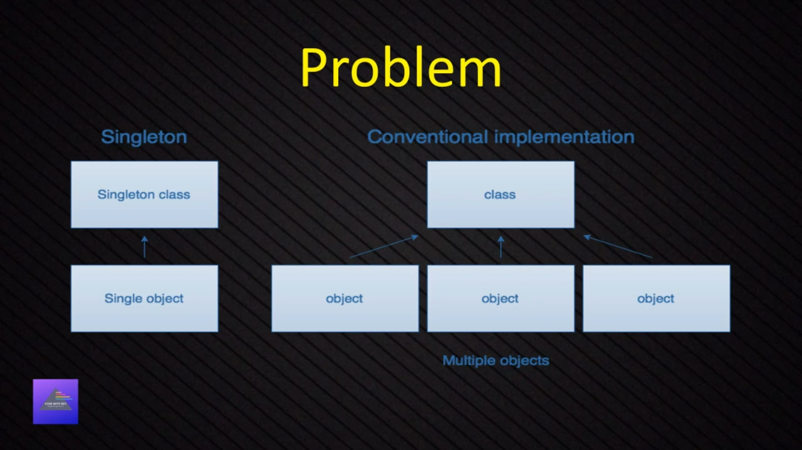
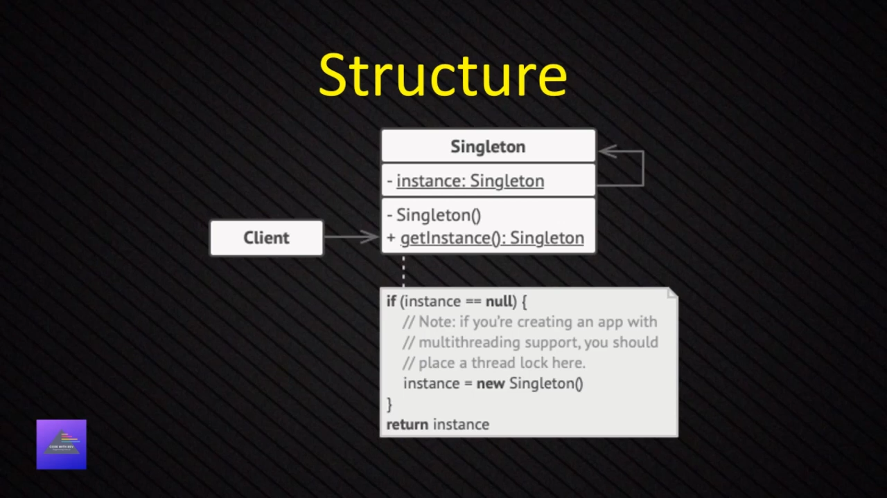

## Creation Design Pattern

### Singleton Design Pattern

The **Singleton Pattern** is a creational design pattern that ensures a class has only one instance and provides a global point of access to that instance.

**Problem**
- Ensure that a class has just a single instance
- Provide a global access point to that instance

**Solution**
- Make default constructor private, to prevent other objects from using the new operator with the Singleton class.
- Create a static creation method that acts as a constructor.





---

#### TypeScript Implementation

```ts
class MySingleton {
  private static instance: MySingleton | null = null;
  private static readonly locker = {}; // Simple lock mechanism

  // Private constructor prevents direct instantiation
  private constructor() {}

  public static getInstance(): MySingleton {
    if (MySingleton.instance === null) {
      // Thread-safe implementation (simplified for TypeScript)
      if (MySingleton.instance === null) {
        MySingleton.instance = new MySingleton();
      }
    }
    return MySingleton.instance;
  }

  // Example method
  public doSomething(): void {
    console.log("Singleton instance is working!");
  }
}

// Usage
const instance1 = MySingleton.getInstance();
const instance2 = MySingleton.getInstance();

console.log(instance1 === instance2); // Output: true (same instance)
instance1.doSomething(); // Output: Singleton instance is working!
```

--- 
**How it Works**
- **Private Constructor**: Prevents direct instantiation with new MySingleton().
- **Static Instance**: Holds the single instance of the class.
- **Static Method**: getInstance() provides controlled access to the instance.
- **Lazy Initialization**: Instance is created only when first requested.
- **Thread Safety**: The double-check locking pattern prevents multiple instances in concurrent environments.

# When to Use Singleton

## ✅ Good for:
- Database connections  
- Logging systems  
- Configuration settings  
- Cache managers  
- Print spoolers  

## ❌ Avoid when:
- You need multiple instances  
- Testing becomes difficult  
- It introduces global state (can make code harder to test)  

> **Key Point:**  
> Singleton ensures one instance exists globally, but use it carefully as it can make code tightly coupled and harder to test.


# When to Identify Singleton Pattern

## ✅ Look for These Characteristics:
- Only one instance needed globally  
- Shared resource management (DB, files, hardware)  
- Global state or configuration  
- Centralized control point  
- Resource pooling or caching  
- Cross-cutting concerns (logging, monitoring)  
- Hardware device access  
- System-wide coordination  

## 💡 Common Naming Patterns:
- **Manager** (e.g., `CacheManager`, `SessionManager`)  
- **Service** (e.g., `LoggingService`, `ConfigService`)  
- **Pool** (e.g., `ConnectionPool`, `ThreadPool`)  
- **Registry** (e.g., `ServiceRegistry`)  
- **Controller** (e.g., `SystemController`)  

## ⚠️ Warning Signs:
- ❌ You need multiple instances  
- ❌ It makes testing difficult  
- ❌ It creates tight coupling  
- ❌ State changes frequently  
- ❌ Different configurations are needed  


**Real-World Scenarios**
1. Database Connection Manager

```js

class DatabaseManager {
  private static instance: DatabaseManager;
  private connection: string;

  private constructor() {
    this.connection = "Connected to Database";
  }

  public static getInstance(): DatabaseManager {
    if (!DatabaseManager.instance) {
      DatabaseManager.instance = new DatabaseManager();
    }
    return DatabaseManager.instance;
  }

  public query(sql: string): void {
    console.log(`Executing: ${sql}`);
  }
}

// All parts of application use same database connection
const db1 = DatabaseManager.getInstance();
const db2 = DatabaseManager.getInstance();
console.log(db1 === db2); // true - same instance
```
2. Logger System
```js
class Logger {
  private static instance: Logger;

  private constructor() {}

  public static getInstance(): Logger {
    if (!Logger.instance) {
      Logger.instance = new Logger();
    }
    return Logger.instance;
  }

  public log(message: string): void {
    console.log(`[${new Date().toISOString()}] ${message}`);
  }
}

// Same logger instance used throughout application
const logger1 = Logger.getInstance();
const logger2 = Logger.getInstance();
logger1.log("Application started"); // Both reference same logger

```

3. Configuration Manager

```js
class ConfigManager {
  private static instance: ConfigManager;
  private config: { [key: string]: string } = {};

  private constructor() {
    // Load configuration from file/environment
    this.config = {
      apiUrl: "https://api.example.com",
      timeout: "5000"
    };
  }

  public static getInstance(): ConfigManager {
    if (!ConfigManager.instance) {
      ConfigManager.instance = new ConfigManager();
    }
    return ConfigManager.instance;
  }

  public get(key: string): string {
    return this.config[key];
  }
}

// Same configuration accessed everywhere
const config1 = ConfigManager.getInstance();
const config2 = ConfigManager.getInstance();
console.log(config1.get("apiUrl")); // Same config data

```
4. Print Spooler
```js
class PrintSpooler {
  private static instance: PrintSpooler;
  private queue: string[] = [];

  private constructor() {}

  public static getInstance(): PrintSpooler {
    if (!PrintSpooler.instance) {
      PrintSpooler.instance = new PrintSpooler();
    }
    return PrintSpooler.instance;
  }

  public addJob(document: string): void {
    this.queue.push(document);
    console.log(`Added to print queue: ${document}`);
  }

  public printNext(): void {
    const job = this.queue.shift();
    if (job) {
      console.log(`Printing: ${job}`);
    }
  }
}

// All print requests go through same spooler
const spooler1 = PrintSpooler.getInstance();
const spooler2 = PrintSpooler.getInstance();
spooler1.addJob("Document1.pdf");
spooler2.printNext(); // Same queue, same instance
```
---

1. Application Settings/Configuration Manager

```ts
class AppConfig {
  private static instance: AppConfig;
  private settings: Map<string, any> = new Map();

  private constructor() {
    this.loadSettings();
  }

  public static getInstance(): AppConfig {
    if (!AppConfig.instance) {
      AppConfig.instance = new AppConfig();
    }
    return AppConfig.instance;
  }

  private loadSettings(): void {
    // Load from config file, environment variables, etc.
    this.settings.set('theme', 'dark');
    this.settings.set('language', 'en');
  }

  public getSetting(key: string): any {
    return this.settings.get(key);
  }
}
```

2. Database Connection Pool
```ts
class DatabasePool {
  private static instance: DatabasePool;
  private connections: Connection[] = [];
  private maxConnections = 10;

  private constructor() {
    this.initializePool();
  }

  public static getInstance(): DatabasePool {
    if (!DatabasePool.instance) {
      DatabasePool.instance = new DatabasePool();
    }
    return DatabasePool.instance;
  }

  public getConnection(): Connection {
    return this.connections.pop() || this.createNewConnection();
  }

  public releaseConnection(conn: Connection): void {
    this.connections.push(conn);
  }
}
```

3. Cache Manager
```ts
class CacheManager {
  private static instance: CacheManager;
  private cache: Map<string, any> = new Map();

  private constructor() {}

  public static getInstance(): CacheManager {
    if (!CacheManager.instance) {
      CacheManager.instance = new CacheManager();
    }
    return CacheManager.instance;
  }

  public set(key: string, value: any, ttl: number = 3600): void {
    this.cache.set(key, { value, expiry: Date.now() + ttl * 1000 });
  }

  public get(key: string): any {
    const item = this.cache.get(key);
    if (item && item.expiry > Date.now()) {
      return item.value;
    }
    this.cache.delete(key);
    return null;
  }
}
```

4. System Logger
```ts
class SystemLogger {
  private static instance: SystemLogger;
  private logFile: string = 'system.log';

  private constructor() {}

  public static getInstance(): SystemLogger {
    if (!SystemLogger.instance) {
      SystemLogger.instance = new SystemLogger();
    }
    return SystemLogger.instance;
  }

  public info(message: string): void {
    this.writeToFile(`[INFO] ${new Date().toISOString()}: ${message}`);
  }

  public error(message: string): void {
    this.writeToFile(`[ERROR] ${new Date().toISOString()}: ${message}`);
  }

  private writeToFile(message: string): void {
    // Write to file system
    console.log(message);
  }
}
```

5. Thread Pool Manager
```ts
class ThreadPoolManager {
  private static instance: ThreadPoolManager;
  private workers: Worker[] = [];
  private maxThreads = 4;

  private constructor() {
    this.initializeThreads();
  }

  public static getInstance(): ThreadPoolManager {
    if (!ThreadPoolManager.instance) {
      ThreadPoolManager.instance = new ThreadPoolManager();
    }
    return ThreadPoolManager.instance;
  }

  public executeTask(task: Function): void {
    const availableWorker = this.getAvailableWorker();
    availableWorker.execute(task);
  }

  private getAvailableWorker(): Worker {
    return this.workers.find(w => w.isIdle()) || this.workers[0];
  }
}
```

6. Hardware Device Manager (Printer / Scanner)
```ts
class PrinterManager {
  private static instance: PrinterManager;
  private isConnected: boolean = false;
  private printQueue: string[] = [];

  private constructor() {
    this.connectToPrinter();
  }

  public static getInstance(): PrinterManager {
    if (!PrinterManager.instance) {
      PrinterManager.instance = new PrinterManager();
    }
    return PrinterManager.instance;
  }

  public print(document: string): void {
    if (this.isConnected) {
      this.printQueue.push(document);
      console.log(`Printing: ${document}`);
    } else {
      console.log('Printer not connected');
    }
  }

  private connectToPrinter(): void {
    this.isConnected = true;
  }
}
```

7. API Rate Limiter
```ts
class RateLimiter {
  private static instance: RateLimiter;
  private requests: Map<string, number[]> = new Map();
  private maxRequests = 100;
  private timeWindow = 3600000; // 1 hour

  private constructor() {}

  public static getInstance(): RateLimiter {
    if (!RateLimiter.instance) {
      RateLimiter.instance = new RateLimiter();
    }
    return RateLimiter.instance;
  }

  public isAllowed(clientId: string): boolean {
    const now = Date.now();
    const clientRequests = this.requests.get(clientId) || [];
    
    // Remove old requests
    const validRequests = clientRequests.filter(time => now - time < this.timeWindow);
    
    if (validRequests.length < this.maxRequests) {
      validRequests.push(now);
      this.requests.set(clientId, validRequests);
      return true;
    }
    
    return false;
  }
}
```

8. Event Bus/Message Broker
```ts
class EventBus {
  private static instance: EventBus;
  private listeners: Map<string, Function[]> = new Map();

  private constructor() {}

  public static getInstance(): EventBus {
    if (!EventBus.instance) {
      EventBus.instance = new EventBus();
    }
    return EventBus.instance;
  }

  public subscribe(event: string, callback: Function): void {
    if (!this.listeners.has(event)) {
      this.listeners.set(event, []);
    }
    this.listeners.get(event)!.push(callback);
  }

  public publish(event: string, data: any): void {
    const callbacks = this.listeners.get(event) || [];
    callbacks.forEach(callback => callback(data));
  }
}
```

9. Session Manager
```ts

class SessionManager {
  private static instance: SessionManager;
  private sessions: Map<string, SessionData> = new Map();

  private constructor() {}

  public static getInstance(): SessionManager {
    if (!SessionManager.instance) {
      SessionManager.instance = new SessionManager();
    }
    return SessionManager.instance;
  }

  public createSession(userId: string): string {
    const sessionId = this.generateSessionId();
    this.sessions.set(sessionId, {
      userId,
      createdAt: Date.now(),
      lastAccessed: Date.now()
    });
    return sessionId;
  }

  public getSession(sessionId: string): SessionData | null {
    const session = this.sessions.get(sessionId);
    if (session) {
      session.lastAccessed = Date.now();
      return session;
    }
    return null;
  }

  private generateSessionId(): string {
    return Math.random().toString(36).substr(2, 9);
  }
}

```

10. Application State Manager
```ts

class AppStateManager {
  private static instance: AppStateManager;
  private state: any = {};
  private observers: Function[] = [];

  private constructor() {}

  public static getInstance(): AppStateManager {
    if (!AppStateManager.instance) {
      AppStateManager.instance = new AppStateManager();
    }
    return AppStateManager.instance;
  }

  public setState(key: string, value: any): void {
    this.state[key] = value;
    this.notifyObservers();
  }

  public getState(key: string): any {
    return this.state[key];
  }

  public subscribe(observer: Function): void {
    this.observers.push(observer);
  }

  private notifyObservers(): void {
    this.observers.forEach(observer => observer(this.state));
  }
}

```