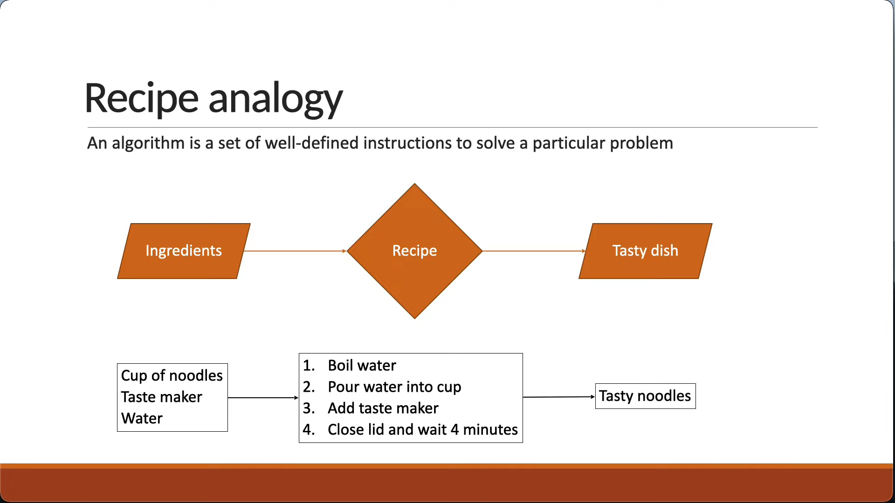
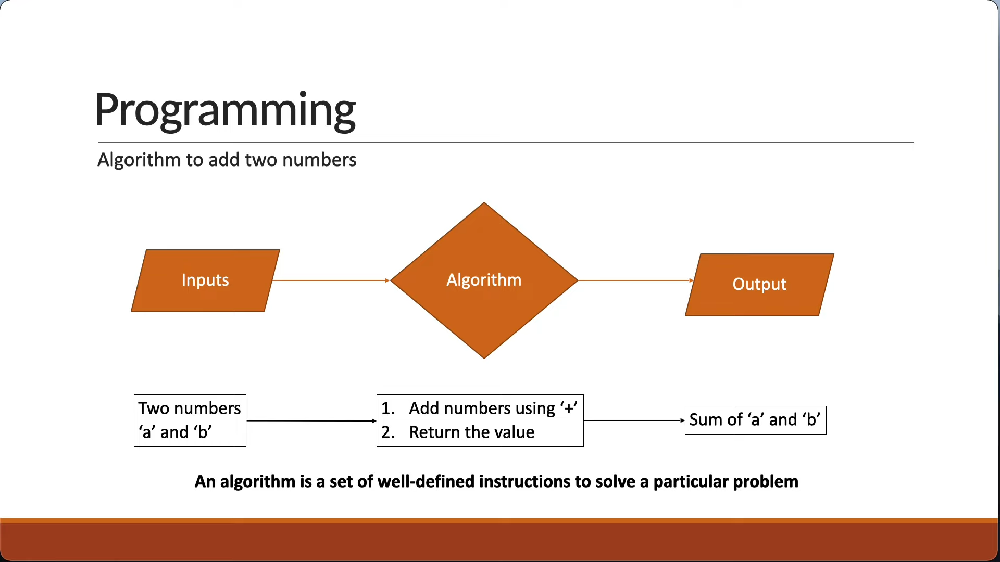
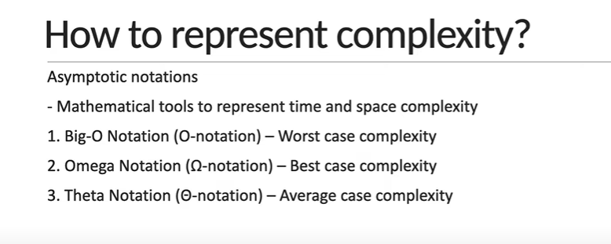
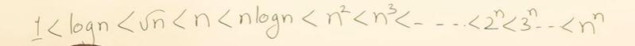
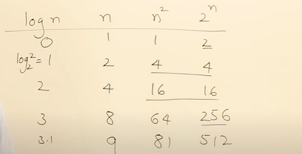

## What is an Algorithm?
An Algorithm is a set of well defined instruction to solve a particular problem.

**Characteristics**
1. Input : They can have 0 or more inputs
2. Output : Algo must generate some output, else there is no use.
3. Definiteness : Each step should be clear and unambiguous, each step give clear and one meaning
4. Finiteness : Algo must terminate at some time, it must have finite steps. Algo is not a service that keep runining.
5. Effectiveness : It must serve some purpose.

- Well defined inputs and outputs
- Each step should be clear and unambiguous
- Language Independent

**Why Algorigthm?**
- As a developer, we're going to come across problems that we need to solve
- Learning algorigthms translates to learning different techniques to efficiently solve those problems.
- One problem can be solved in many ways using different algorigthms
- Every algorithm comes with its own tradeoffs when it comes to performance.

| Algorithms            | Program                   |
|-----------------------|---------------------------|
| Design                | Implementation            |
| Domain Knowledge      | Programmes                |
| Any Language          | Programming Language      |
| H/w & OS Independent  | Dependent on H/w and OS   |
| Analyze               | Testing                   |

## Algorithm Analysis
- There are multiple ways to solve one problem
- Ex: There are multiple algorithms to sort a list of numbers
- How do we analyse which one of them is the most efficient algorithms?
- Generally, when we talk about performance, we use an absolute measure
- If i can run 100 meters in 12 seconds, I'm faster than someone who takes 15 seconds.

- The absolute running time of an algorithm cannot be predicted, since it depends on a number of factors
    - Programming language used to implement the algorithm
    - The computer the program runs on
    - Other programs running at the same time
    - Quality of the OS

- We evaluate the performance of an algorithm in terms of its input size.
**Time Complexity** - Amount of time taken by an algo to run, as a function of input size
**Space Complexity** - Amount of memory taken by a an algo to run as a function of input size.

- By evaluating against the input size, the analysis is not only machine independent but the comparison is also more appropriate.
- There is no one solution that works every single time. It is always good to know multiple ways to solve the problem and use the best solution, given your constraints.
- If your app needs to be very quick and has plenty of memory to work with, you don't have to worry about the space complexity.
- If you have very little memory to work with, you should pick a solution that is relatively slower but needs less space.

### Compare Class of Functions

### Frequency Count Method
