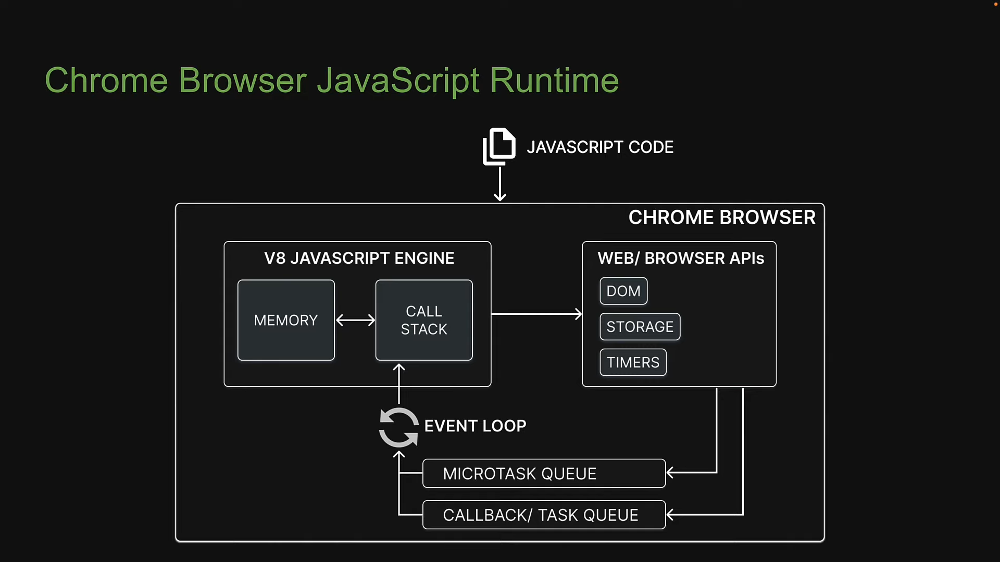
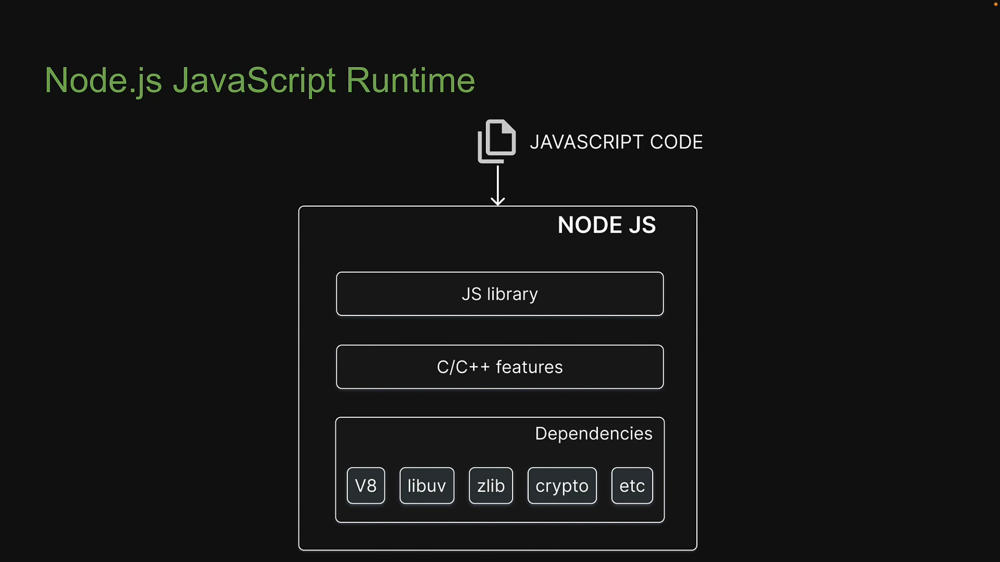
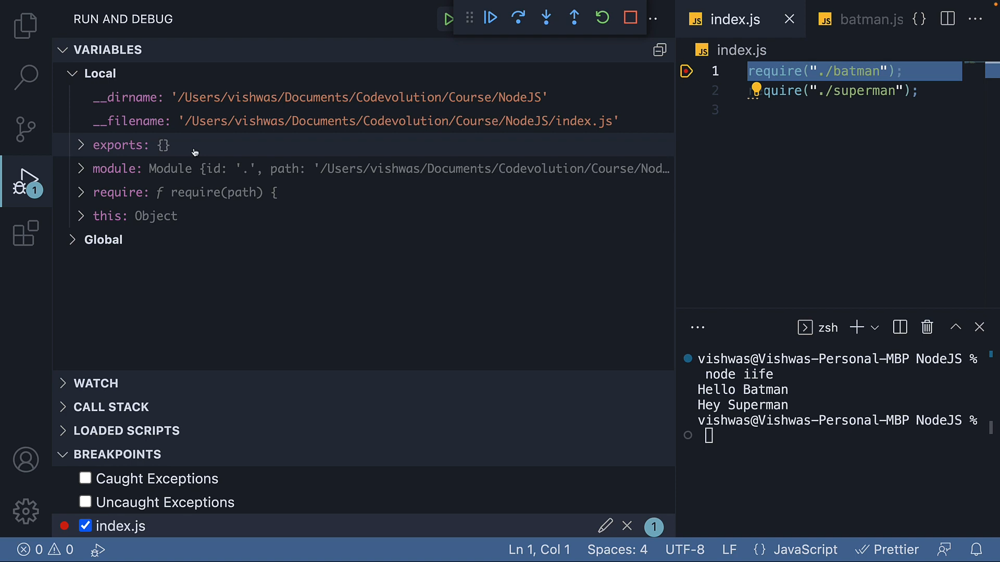
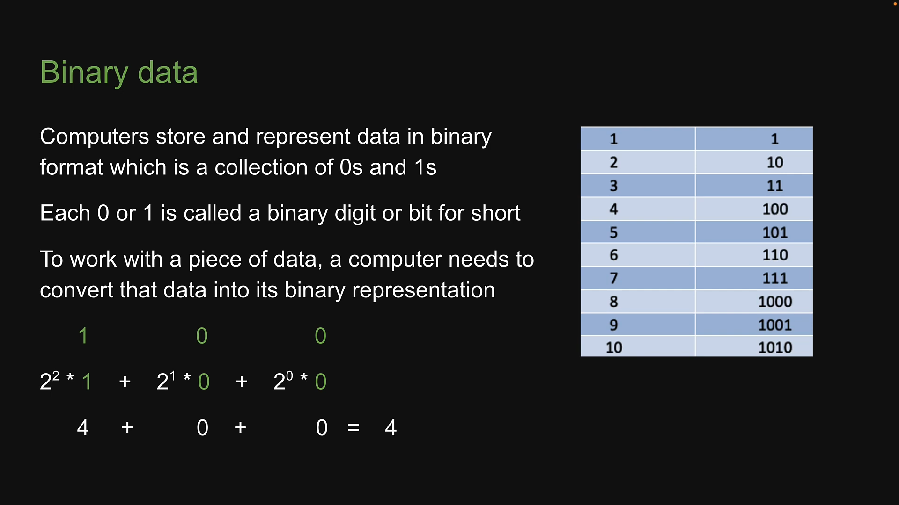
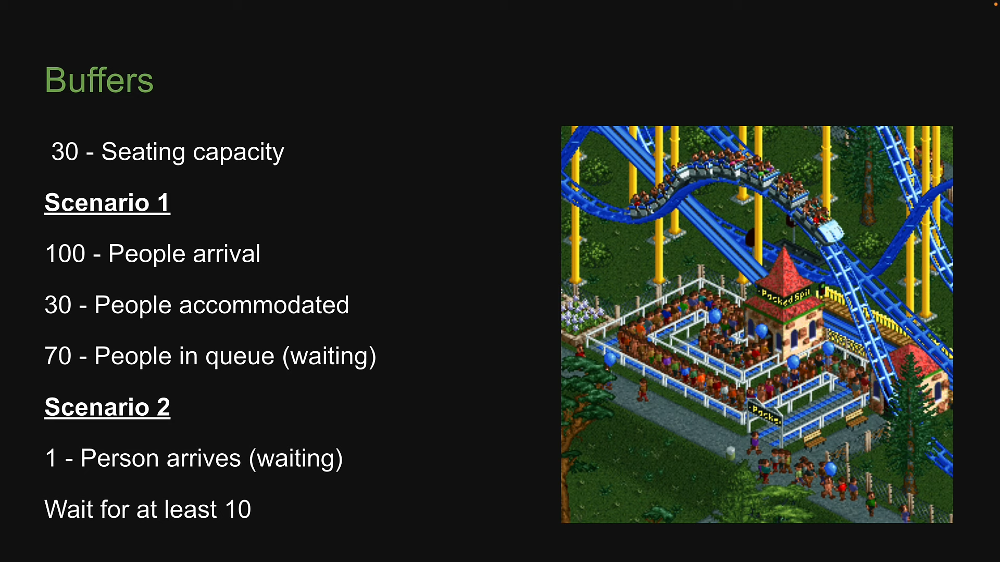
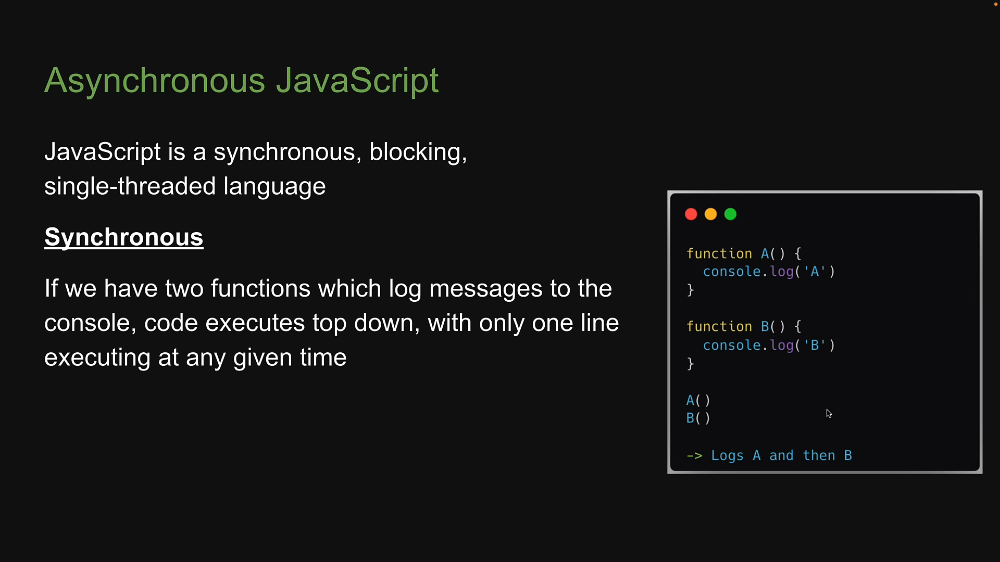
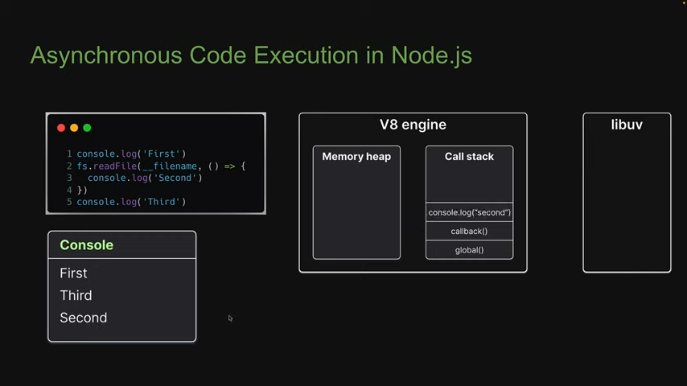
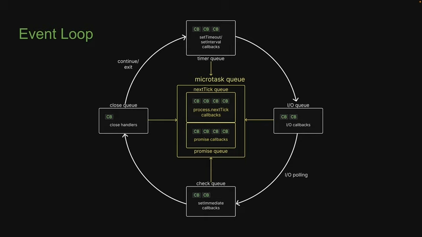

## Course Structure
- Term and concepts to understand what is node.js
- Modules (user defined)
- Built in modules
- Node.js internals
- npm : Node Package Manager
- CLI tools
- Misc

## Prerequisities:
- Modern Javascript

Table of Content:

- [Introduction](#introduction)
- [ECMAScript](#ecmascript)
- [Chrome's V8 Engine](#chrome-v8-engine)
- [JavaScript Runtime](#javascript-engine)
- [Browser vs Node.js](#browser-vs-nodejs)
- [Modules](#modules)
- [Local Modules](#local-modules)
- [Module Exports](#module-exports)
- [Module Scope](#module-scope)
- [Module Wrapper](#module-wrapper)
- [Module Caching](#module-caching)
- [Callback Pattern](#callback-pattern)
- [Character Sets and Encoding](#character-sets-and-encoding)
- [Asynchronous JavaScript](#asynchronous-javascript)
 


## Term and concepts to understand what is node.js

### Introduction
**What is Node.js**?
Node.js is an open-source, cross-platform Javascript runtime environment.

- **Open Source** : source code is publicly available for sharing and modification
- **Cross Platform** : Available on Mac, Windows and Linux
- **JavaScript runtime Environment** : 
    - JavaScript runtime is an environment which provides all the necessary components in order to use and run a JavaScript program ***outside the browser***.
    - Every browser has a JavaScript Engine
    - A ***JavaScript Engine*** is one component in the JavaScript runtime.
    - What else does the JavaScript runtime consist of?
        - 

    - ECMAScript >> JavaScript Engine (V8) >> JavaScript runtime

### Why learn Node.js?
- Build end to end javascript applications.
- A number of major companies like LinkedIn, NetFlix, Paypal have all migrated to node.js from other backend technologies.
- Full stack development is one of the most sought out skill sets by companies.
- Huge Community support.

### ECMAScript
**Going back in time...**
- In 1993, the first web browser with a user interface called Mosaic was released
- In 1994, the lead developers of Mosaic founded a company called Netscape and released a more polished browser called Netscape Navigator
- Web pages could only be static and there was no interactivity after a page was loaded.
- 1995, Netscape created a new scripting language called JavaScript


**The advent of Microsoft**
- In 1995, Microsoft debuted their browser Internet Explorer
- Microsoft realised that JavaScript fundamentally changed the user experiance of the web and wanted the same for internet explorer.
- But there was no specification to follow
- 1996, Microsoft reverse-engineered the Navigator interpreter to create its own scripting language called JScript
- The difference made it difficult for developers to make their websites work well in both browsers.
- "Best viewed in Netscape" and " Best viewed in Internet explorer" badges became common.


**Ecma International**
- In Nov 1998, Netscape submitted JavaScript to Ecma International
- It is an industry association dedicated to the standarization of information and communication systems
- Netscape wanted a standard specification that all browsers vendors could conform to as it would help keep other implementations consistent across browsers.
- For each new specification Ecma provides a standard specification and a committee.
- In case of JavaScript, the standard is called ECMA-262 and the committee that works on ECMA-262 is called Technical Committee 39(TC39)
- Ecma however decided to use the term "ECMAScript" to talk about the official language.
- The reason for this is because Oracle(who acquired Microsystem) owns the trademark for the term "JavaScript"
- ECMAScript refers to the standard language whereas JavaScript is what we use is practice and builds on top of ECMAScript.

**ECMAScript versoins**
- 1997 - ECMAScript 1
- 1998 - ECMAScript 2
- 1999 - ECMAScript 3
- xxxx - ECMAScript 4 never released
- 2009 - ECMAScript 5
- 2015 - ECMAScript 6(ES6) or (ECMAScript 2015)

One version every year since 2015

**ECMAScript summary**
- ECMA-262 is the language specification
- ECMAScript is the language taht implements ECMA-262
- JavaScript is basically ECMAScript at its core but builds on top of that.


### JavaScript Engine
JavaScript code we write cannot be understand by the computer.
A ***JavaScript engine*** is a program that converts javascript code that developers write into machine code that allows a computer to perform specific tasks
- JavaScript engines are typically developed by web browser vendor
    - V8 - Open source JavaScript engine developed by Google for Chrome
    - SpiderMonkey - The JavaScript engine powering Mozilla Firefox
    - JavaScriptCore - Open source javascript engine developed by Apple for Safari.
    - Chakra - A javascript engine for the original Microsoft Edge (The latest version of edge uses V8)

**V8 JavaScript Engine**
- V8 is Google's open source JavaScript engine
- V8 implements ECMAScript as specified in ECMA-262
- V8 is written in C++ and is used in Google Chrome, the open source browser from Google.
- V8 can run standalone, or can be embedded into any c++ application
- source link: [https://github.com/v8/v8] and [https://v8.dev/docs]

### Chrome V8 Engine

**Chrome's V8 & JavaScript Engine**
- Chrome's V8 engine by Google sits at the core of Node.js
- By embedding V8 into your own C++ application, you can write C++ code that gets executed when a user writes javascript code.
- You can add new features to Javascript itself.
- Since C++ is great for lower level operations like file handling, database connections and network operations, by embedding V8 into your own C++ program, you have the power to add all of that functionality in Javascript.
- The C++ program we're talking about is Node.js (Node.js is a lot more than just a C++ program)


**Chrome's V8 Engine Summary**

- A JavaScript engine is a program that executes JavaScript code.
- In 2008, Google created its own JavaScript engine called V8.
- V8 is written in C++ and can be used independently or can be embedded into other C++ programs.
- That allows you to write your own C++ programs which can do everything that V8 can do and more.
- Your C++ program can run ECMAScript and additional features that you choose to incorporate.
- For example, features that are available in C++ but not available with JavaScript.

**What can you build with Node.js**
- Traditional Websites
- Backend services like APIs
- Real time applications
- Streaming services
- CLI tools
- Multiplayer games

**Source Code studying**
- [https://github.com/nodejs/node/tree/main/deps]
- deps folder highlights all the dependancies a nodejs have including V8
- uv for accessing os related system such as file system, networking etc.
- [https://github.com/nodejs/node/tree/main/deps]
- src folder which contain the C++ src code.


**Important** : unlike browser runtime, node js runtime does not have access to webAPI.

**Node.js Summary**
- Node.js is an open-source, cross-platform Javascript runtime environment
- It is not a language, it is not a framework
- Capable of executing JavaScript code outside of browser
- It can execute not only the standard ECMAScript language but also new features that are made available through C++ binding using the V8 engine.
- It consists of C++ files which form the core features and JavaScript files which expose common utilities and some of C++ features for easier consumption.
- 

### Executing JavaScript with Node
1. Node **REPL**
    - **R**ead
    - **E**valuate
    - **P**rint
    - **L**oop

2. Executing code in a JavaScript file in the command line.

### Browser vs Node.js
- In the browser, most of the time what you are doing is interacting with the DOM, or other Web Platform APIs like Cookies. You don't have the document, windows and all the other objects that are provided by the browser.
- In the browser, we don't have all the nice API that Node.js provides through its modules. For example the filesystem access functionality.
- With node.js, you control the environment
- With a browser, you are at the mercy of what the user choose.


## Modules 
- A module is an encapsulated and reusable chunk of code that has its own context
- In Node.js, each file is treated as a separated module.
- Types of Modules
    1. Local Modules - Modules that we create in our application
    2. Built-in Modules - Modules that Node.js ships with out of the box.
    3. Third party Modules - Modules written by other developers that we can use in our applicatoin.

### Local Modules
**CommonJS**
- CommonJS is a standard taht states how a module should be structured and shared
- Node.js adopted CommonJS when it started out and is what you will see in code bases

**Local Modules Summary**
- In node.js, each file is a module that is isolated by default.
- To load a module into another file, we use the requier function.

(add.js)
```js 
const add = (a, b) => {
    return a+b;
}
const sum = add(2,4)
console.log(sum)
```

(index.js)
```js 
requier(./add)
console.log("the output of add function will display above.")
```

### Module Exports

(add.js)
```js 
const add = (a, b) => {
    return a+b;
}

module.exports = add;
// it is similar to export default add;
```

(index.js)
```js 
const addFn = requier(./add)

const sum = addFn(2,4)
console.log(sum)

const sum2 = addFn(3,4)
console.log(sum2)

```

### Module Scope
- In node.js each module has own scope, so if we are importing two files that has same function with same name, it will still run, as each module has it's own scope and local function define and execute in same scope.

- Each loaded module in node.js is wrapped with an IIFE that provides private scoping of code.
- IIFE allows you to repeat variable of function names without any conflicts

iife.js
```js
(function() {
    const superHero = "Batman"
    console.log(superHero)
})()

(function() {
    const superHero = "Superman"
    console.log(superHero)
})()

```
### Immediately invoked function Expression (IIFE) in Node.js
- Before a module's code is executed, Node.js will wrap it with a function wrapper that provides module scope.
- this save us from having to worry about conflicting variables or functions.
- There is proper encapsulation and reusability is unaffected.

### Module Wrapper
- Every module in node.js gets wrapped in an IIFE before being loaded
- IIFE helps keep top-level variables scoped to the module rather than the global object.
- The IIFE that wraps with every module contains 5 parameters which are pretty important for the functioning of a module.




```js
(function(exports, require, module, __filename, __dirname){
    const superHero = "Batman";
    console.log(superHero);
})

```

### Module Caching

```js
//superhero.js

class SuperHero{
    constructor(name){
        this.name = name
    }

    getName (){
        return this.name
    }

    setName(name){
        this.name = name;
    }
}

module.exports = new SuperHero("Batman")

// index.js
const superHero = require("./superhero")
console.log(superHero.getName())

superHero.setName("Superman")
console.log(superHero.getName())

const newSuperHero = require("./superhero")
console.log(superHero.getName())

```
- to avoid unnecessary bug, export the class not a instance of the class.

```js
//superhero.js

class SuperHero{
    constructor(name){
        this.name = name
    }

    getName (){
        return this.name
    }

    setName(name){
        this.name = name;
    }
}

module.exports = SuperHero;

// index.js
const superHero = require("./superhero")
const batman = new SuperHero("Batman")
console.log(batman.getName())

batman.setName("New Batman")
console.log(batman.getName())

const superman = new SuperHero("SuperMan")
console.log(superman.getName())

```

--- 
### Callback Pattern


```js
function greet(name){
    console.log(`Hello ${name}`);
}

function HighOrderFn(callback){
    const name = "Shiv";
    callback(name);
}

```
- **Callback**: A fn that is used as a argument (or passed as argument) in another fn is called callback fn.
- **HighOrderFunction**: A fn that accept fn as argument is called HighOrderFunction.

Callback fn are two types
1. Synchronous Callbacks
    - A callback which is executed immediately is called a synchronous callback.
    - Examples includes:
        ```js
            let numbers = [1,2,3,4,5,6]
            numbers.sort((a,b) => a-b)
            numbers.filter( n => n%2 === 0)
            numbers.map(n => n/2)
        ```
2. Asynchronous Callbacks
    - A callback that is often used to continue or resume code execution after an asynchronous operations has completed.
    - Callbacks are used to delay the execution of a function until a particular time or event has occured.
    - In node.js have an async nature to prevent blocking of execution.
    - Ex: reading data from a file, fetching data from a database or handling a network request.
    ```js
        function callbackfn(){
            document.getElementById("demo").innerHTML = "hello shiv"
        }
        document.getElementById("btn").addEventListener("click", callbackfn)

        <!-- data fetching ex -->
        fetch("url")
            .then(response => {
                if (!response.ok) {
                throw new Error("Network response was not ok");
                }
                return response.text();
            })
            .then(data => {
                document.querySelector(".result").innerHTML = data;
                alert("Load was performed");
            })
            .catch(error => {
                console.error("There was a problem with the fetch operation:", error);
            });

            <!-- typescrpt ex -->
            fetch("url")
                .then((response: Response) => {
                    if (!response.ok) {
                    throw new Error("Network response was not ok");
                    }
                    return response.text();
                })
                .then((data: string) => {
                    const resultElement = document.querySelector(".result") as HTMLElement;
                    if (resultElement) {
                    resultElement.innerHTML = data;
                    }
                    alert("Load was performed");
                })
                .catch((error: Error) => {
                    console.error("There was a problem with the fetch operation:", error);
                });
    ```

---

### Events Module
- The events module allows us to work with events in Node.js
- An event is an action or an occurance that has happened in our application that we can respond to.
- Using the events module, we can dispatch our own custom events and respond to those custom events in a non-blocking manner.

```js
const EventEmitter = require("node:events");

const emitter = new EventEmitter();

emitter.on("order-pizza", (size, topping) => {
    console.log(`Order received, Baking a ${size} pizza with ${ topping }`);
})

emitter.on("order-pizza", (size) => {
    if(size === "large"){
        console.log(`Serving complimentary drink`);
    }
})

emitter.emit("order-pizza", "large", "mushrooms");

```

### Extending from EventEmitter
```js

const EventEmitter = require("events");

class PizzaShop extends EventEmitter {
    constructor() {
        super();
        this.orderNumber = 0;
    }

    order(size, topping) {
        this.orderNumber++;
        this.emit("order", size, topping);
    }

    displayOrderNumber() {
        console.log(`Current order number: ${this.orderNumber}`);
    }
}

module.exports = Pizzashop;

```

```js
class DrinkMachine {
    serveDrink(size) {
        if (size === "large") {
        console.log("Serving complimentary drink");
        }
    }
}
module.exports = DrinkMachine
```

```js
const Pizzashop = require("./pizza-shop")
const DrinkMachine = require("./drink-machine")

const pizzaShop = new PizzaShop();
const drinkMachine = new DrinkMachine();

pizzaShop.on("order", (size, topping) => {
  console.log(`Order received! Baking a ${size} pizza with ${topping}`);
  drinkMachine.serveDrink(size);
});

pizzaShop.order("large", "mushrooms");

```

---
### Character Sets and Encoding


**Character in binary format**
- V?
- Computers will first convert (v) the character to a number, then convert that number to its binary representation.
- Computers will first convert V to a number that represents V
- for learning, get any character number by type in browser console "V".charCodeAt()
- 86 is the numeric representation of the character V.
- It is also called character code
- How does the computer know V should be represented as 86

**Character Sets**
- Character Sets are predefined lists of characters represented by numbers
- Popular character sets
    - Unicode 
    - ASCII
- Unicode character set dictates that 86 should represent character V

**Character Encoding**
- Character encoding dictates how to represent a number in a character set as binary data before it can be stored in a computer.
- It dictates how many bits to use to represent the number
- Example of a character encoding system is UTF-8
- UTF-8 states that characters should be encoded in bytes (8 bits)
- 4 => 100 => 00000100
- V => 86 => 01010110
- Similar guidelines also exist on how images and videos should be encoded and stored in binary format.

**Summary*
- Binary Data - 0s and 1s that computers can understand
- Character Sets - Predefined lists of characters represented by numbers
- Character Encoding - Dictates how to represent a number in a character set as binary data

--- 
### Streams and Buffers

**Streams**
- A stream is a sequence of data that is being moved from one point to another over time
- Ex: a stream of data over the internet being moved from one computer to another
- Ex: a stream of data being transferred from one file to another within the same computer
- Process streams of data in chunks as they arrive instead of waiting for the entire data to be available before processing.
- Ex: watching a video on YouTube
- The data arrives in chunks and you watch in chunks while the rest of data arrives over time.
- Ex: transfering file contents from fileA to fileB
- The contents arrive in chunks and you transfer in chunks while the remaining content arrive over time
- Prevents unnecessary data downloads and memory usage.

**Buffers**

- Area where people wait is nothing but the buffer
- Node.js cannot control the pace at which data arrives in the steam
- It can only decide when is the right time to send the data for processing
- If there is data already processed or too little data to process, Node puts the arriving data in a buffer 
- It is an intentionally small area that Node maintains in the runtime to process a stream of data.
- Ex: streaming a video online
- If your internet connection is fast enough, the speed of the stream will be fast enough to instantly fill up the buffer and send it out for processing
- That will repeat till the stream is finished
- If your connection is slow, after processing the first chunk of data that arrived, the video player will display a loading spinner which indicates it is waiting for more data to arrive.
- once the buffer is filled up and the data is processed, the video player shows the video
- While the video is playing, more data will continue to arrive and wait in the buffer
- Binary data, character sets and encoding < = > Buffers?

```js
const buffer = new Buffer.from("Shiv")

buffer.write("Coding")
console.log(buffer.toString())
console.log(buffer)
console.log(buffer.toJSON())

```
```bash
> node ref-test-js.js

Codi
<Buffer 73 68 69 76>
{ type: 'Buffer', data: [ 115, 104, 105, 118 ] }
```

#https://unicode-table.com/en/

---
### Asynchronous JavaScript



- Blocking
    - No matter how long a previous process takes, the subsequent processes won't kickoff until the former is completed.
    - Web app runs in a browser and it executes an intensive chunk of code without returning control to the browser, the browser can appear to be frozen.

- Single-threaded
    - A thread is simply a process that your javascript program can use to run a task.
    - Each thread can only do one task at a time.
    - Javascript has just the one thread called the main thread for executing any code.

- Problem
    - Problem with synchronous, blocking, single-threaded model of Javascript
    ```js
    let response = fetchDataFromDB("URLENDPOINT")
    displayDataFromDB(response)
    ```
    - fetchDataFromDB could take 1 sec. or even more
    - During that time, we can't run any further code 
    - JavaScript, if it simply proceeds to the next line without waiting, we have an error because data is not what we expected it to be.
    - Just JavaScript is not enough
    - We need new pieces which are outside of JavaScript to help us write asynchronous code.
    - For front-end, this is where web browsers come into play. 
    - For Back-end, this is where Node.js comes into play.
    - Web browsers and Node.js define functions and APIs that allow us to register functions that should not be executed synchronously, and should instead be invoked asynchronously when some kind of event occurs.
    - For example, that could be the passage of time (setTimeout or setInterval), the user's interaction with the mouse(addEventListener), data being read from a file system or the arrival of data over the network (callbacks, Promises, async-await)
    - You can let your code do several things at the same time without stopping or blocking your main thread.

- Summary 
    - JavaScript is a Synchronous, blocking, single-threaded language
    - This nature however is not beneficial for writing apps
    - We want non-blocking asynchronous behavious which is made possible by a browser for FE and Node.js for BE.
    - This style of programming where we don't block the main JavaScript thread is fundamental to Node.js and is at the heart of how some of the built-in module code is written.    

---
### fs Module


---
### Event Loop

**Async Code Execution**
- Javascript is a synchronous, blocking, single-threaded language
- To Make async programming possible, we need the help of libuv 


**Few Questions**
- Whenever an async task completes in libuv, at what point does Node decide to run the associated callback function on the call stack?
- What about async methods like setTimeout and setInterval which also delay the execution of a callback function?
- If two async task such as setTimeout and readFile complete at the same time, how does Node decide which callback function to run first on the call stack?


**Event Loop**
- It is a C program and is part of libuv
- A design pattern that orchestrate or co-ordinates the execution of synchronous and asynchronous code in Node.js



**Event Loop - Execution Order**
1. Any callbacks in the micro task queues are executed. First, task in the nextTick queue and only then task in the promise queue.
2. All callbacks within the timer queue are executed, then, 
    - Callbacks in the micro task queues if present are executed. Again, first tasks in the nextTick queue and then task in the promise queue.
3. All callbacks within the I/O queue are executed.  then, 
    - Callbacks in the micro task queues if present are executed. Again, first tasks in the nextTick queue and then task in the promise queue.
4. All callbacks within the check queue are executed. then, 
    - Callbacks in the micro task queues if present are executed. Again, first tasks in the nextTick queue and then task in the promise queue.   
5. All callbacks within the close queue are executed. then, 
    - Callbacks in the micro task queues if present are executed. Again, first tasks in the nextTick queue and then task in the promise queue.   
6. For one final time in the same loop, the micro task queue are executed. nextTick queuce followed by promise queue.    

if there are more callbacks to be processed, the loop is kept alive for one more run and the same steps are repeated.
On the other hand, if all callbacks are executed and there is no more code to process, the event loop exists.


**Answer's of Questions**
- Whenever an async task completes in libuv, at what point does Node decide to run the associated callback function on the call stack?
    - Callback fn are executed only when the call stack empty. The normal flow of execution fill not be interrupted to run a callback fn.
- What about async methods like setTimeout and setInterval which also delay the execution of a callback function?
    - setTimeout and setInterval callbacks are given first priority.
- If two async task such as setTimeout and readFile complete at the same time, how does Node decide which callback function to run first on the call stack?
    - Timer callbacks are executed before I/O callbacks even if both are ready at the exact same time.


    