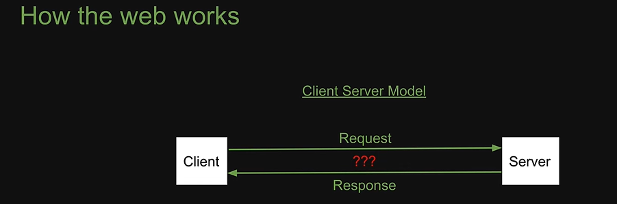
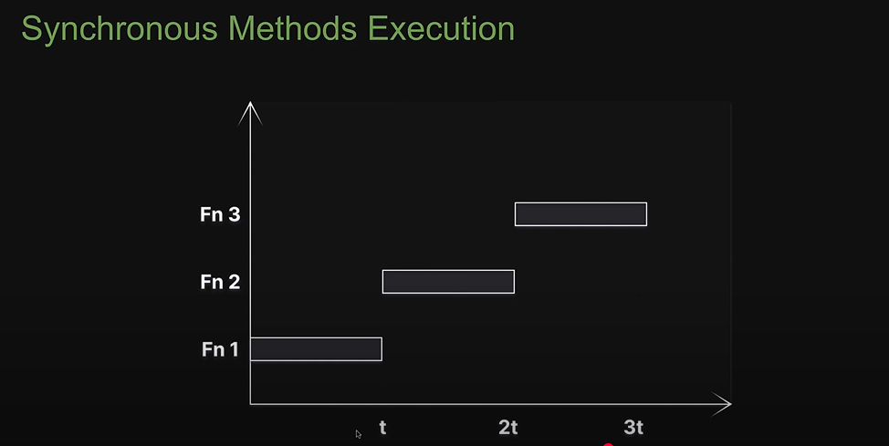
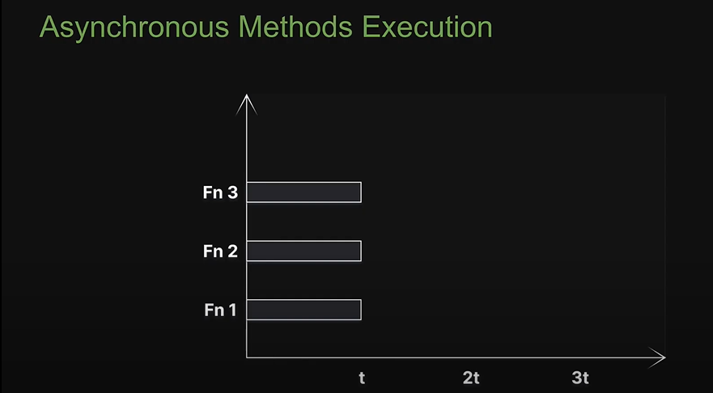
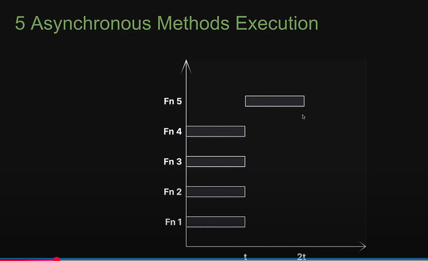
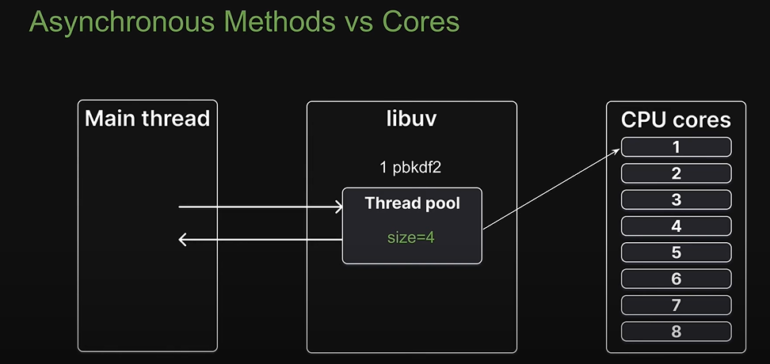
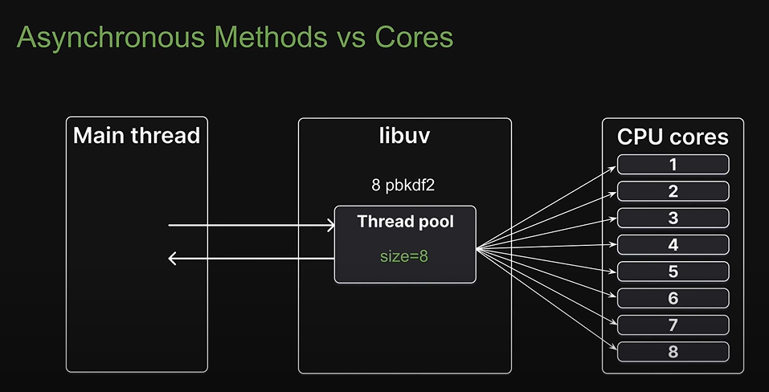
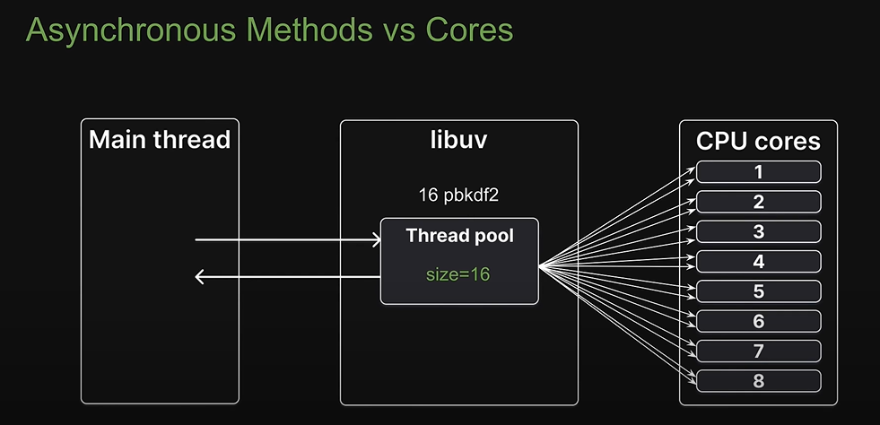
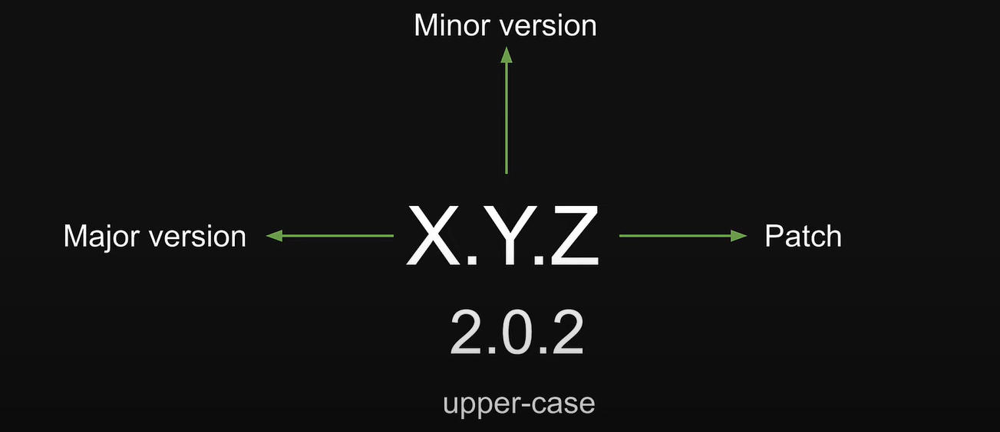

## Course Structure

-   Term and concepts to understand what is node.js
-   Modules (user defined)
-   Built in modules
-   Node.js internals
-   npm : Node Package Manager
-   CLI tools
-   Misc

## Prerequisities:

-   Modern Javascript

Table of Content:

-   [Introduction](#introduction)
-   [ECMAScript](#ecmascript)
-   [Chrome's V8 Engine](#chrome-v8-engine)
-   [JavaScript Runtime](#javascript-engine)
-   [Browser vs Node.js](#browser-vs-nodejs)
-   [Modules](#modules)
-   [Local Modules](#local-modules)
-   [Module Exports](#module-exports)
-   [Module Scope](#module-scope)
-   [Module Wrapper](#module-wrapper)
-   [Module Caching](#module-caching)
-   [Callback Pattern](#callback-pattern)
-   [Character Sets and Encoding](#character-sets-and-encoding)
-   [Asynchronous JavaScript](#asynchronous-javascript)
-   [fs Module](#fs-module)
-   [Streams](#streams)
-   [Pipes](#pipes)
-   [HTTP Module](#http-module)
-   [Node Runtime Recap](#node-runtime-recap)
-   [Libuv](#libuv)
-   [Thread Pool](#thread-pool)
-   [Network I/O](#network-io)
-   [Event Loop](#event-loop)
-   [Microtask Queues](#microtask-queues)
-   [What is npm](#what-is-npm)
-   [Installing Packages & package-lock.json](#installing-packages)


## Term and concepts to understand what is node.js

### Introduction

**What is Node.js**?
Node.js is an open-source, cross-platform Javascript runtime environment.

-   **Open Source** : source code is publicly available for sharing and modification
-   **Cross Platform** : Available on Mac, Windows and Linux
-   **JavaScript runtime Environment** :

    -   JavaScript runtime is an environment which provides all the necessary components in order to use and run a JavaScript program **_outside the browser_**.
    -   Every browser has a JavaScript Engine
    -   A **_JavaScript Engine_** is one component in the JavaScript runtime.
    -   What else does the JavaScript runtime consist of?

        -   

    -   ECMAScript >> JavaScript Engine (V8) >> JavaScript runtime

### Why learn Node.js?

-   Build end to end javascript applications.
-   A number of major companies like LinkedIn, NetFlix, Paypal have all migrated to node.js from other backend technologies.
-   Full stack development is one of the most sought out skill sets by companies.
-   Huge Community support.

### ECMAScript

**Going back in time...**

-   In 1993, the first web browser with a user interface called Mosaic was released
-   In 1994, the lead developers of Mosaic founded a company called Netscape and released a more polished browser called Netscape Navigator
-   Web pages could only be static and there was no interactivity after a page was loaded.
-   1995, Netscape created a new scripting language called JavaScript

**The advent of Microsoft**

-   In 1995, Microsoft debuted their browser Internet Explorer
-   Microsoft realised that JavaScript fundamentally changed the user experiance of the web and wanted the same for internet explorer.
-   But there was no specification to follow
-   1996, Microsoft reverse-engineered the Navigator interpreter to create its own scripting language called JScript
-   The difference made it difficult for developers to make their websites work well in both browsers.
-   "Best viewed in Netscape" and " Best viewed in Internet explorer" badges became common.

**Ecma International**

-   In Nov 1998, Netscape submitted JavaScript to Ecma International
-   It is an industry association dedicated to the standarization of information and communication systems
-   Netscape wanted a standard specification that all browsers vendors could conform to as it would help keep other implementations consistent across browsers.
-   For each new specification Ecma provides a standard specification and a committee.
-   In case of JavaScript, the standard is called ECMA-262 and the committee that works on ECMA-262 is called Technical Committee 39(TC39)
-   Ecma however decided to use the term "ECMAScript" to talk about the official language.
-   The reason for this is because Oracle(who acquired Microsystem) owns the trademark for the term "JavaScript"
-   ECMAScript refers to the standard language whereas JavaScript is what we use is practice and builds on top of ECMAScript.

**ECMAScript versoins**

-   1997 - ECMAScript 1
-   1998 - ECMAScript 2
-   1999 - ECMAScript 3
-   xxxx - ECMAScript 4 never released
-   2009 - ECMAScript 5
-   2015 - ECMAScript 6(ES6) or (ECMAScript 2015)

One version every year since 2015

**ECMAScript summary**

-   ECMA-262 is the language specification
-   ECMAScript is the language taht implements ECMA-262
-   JavaScript is basically ECMAScript at its core but builds on top of that.

### JavaScript Engine

JavaScript code we write cannot be understand by the computer.
A **_JavaScript engine_** is a program that converts javascript code that developers write into machine code that allows a computer to perform specific tasks

-   JavaScript engines are typically developed by web browser vendor
    -   V8 - Open source JavaScript engine developed by Google for Chrome
    -   SpiderMonkey - The JavaScript engine powering Mozilla Firefox
    -   JavaScriptCore - Open source javascript engine developed by Apple for Safari.
    -   Chakra - A javascript engine for the original Microsoft Edge (The latest version of edge uses V8)

**V8 JavaScript Engine**

-   V8 is Google's open source JavaScript engine
-   V8 implements ECMAScript as specified in ECMA-262
-   V8 is written in C++ and is used in Google Chrome, the open source browser from Google.
-   V8 can run standalone, or can be embedded into any c++ application
-   source link: [https://github.com/v8/v8] and [https://v8.dev/docs]

### Chrome V8 Engine

**Chrome's V8 & JavaScript Engine**

-   Chrome's V8 engine by Google sits at the core of Node.js
-   By embedding V8 into your own C++ application, you can write C++ code that gets executed when a user writes javascript code.
-   You can add new features to Javascript itself.
-   Since C++ is great for lower level operations like file handling, database connections and network operations, by embedding V8 into your own C++ program, you have the power to add all of that functionality in Javascript.
-   The C++ program we're talking about is Node.js (Node.js is a lot more than just a C++ program)

**Chrome's V8 Engine Summary**

-   A JavaScript engine is a program that executes JavaScript code.
-   In 2008, Google created its own JavaScript engine called V8.
-   V8 is written in C++ and can be used independently or can be embedded into other C++ programs.
-   That allows you to write your own C++ programs which can do everything that V8 can do and more.
-   Your C++ program can run ECMAScript and additional features that you choose to incorporate.
-   For example, features that are available in C++ but not available with JavaScript.

**What can you build with Node.js**

-   Traditional Websites
-   Backend services like APIs
-   Real time applications
-   Streaming services
-   CLI tools
-   Multiplayer games

**Source Code studying**

-   [https://github.com/nodejs/node/tree/main/deps]
-   deps folder highlights all the dependancies a nodejs have including V8
-   uv for accessing os related system such as file system, networking etc.
-   [https://github.com/nodejs/node/tree/main/deps]
-   src folder which contain the C++ src code.

**Important** : unlike browser runtime, node js runtime does not have access to webAPI.

**Node.js Summary**

-   Node.js is an open-source, cross-platform Javascript runtime environment
-   It is not a language, it is not a framework
-   Capable of executing JavaScript code outside of browser
-   It can execute not only the standard ECMAScript language but also new features that are made available through C++ binding using the V8 engine.
-   It consists of C++ files which form the core features and JavaScript files which expose common utilities and some of C++ features for easier consumption.
-   

### Executing JavaScript with Node

1. Node **REPL**

    - **R**ead
    - **E**valuate
    - **P**rint
    - **L**oop

2. Executing code in a JavaScript file in the command line.

### Browser vs Node.js

-   In the browser, most of the time what you are doing is interacting with the DOM, or other Web Platform APIs like Cookies. You don't have the document, windows and all the other objects that are provided by the browser.
-   In the browser, we don't have all the nice API that Node.js provides through its modules. For example the filesystem access functionality.
-   With node.js, you control the environment
-   With a browser, you are at the mercy of what the user choose.

## Modules

-   A module is an encapsulated and reusable chunk of code that has its own context
-   In Node.js, each file is treated as a separated module.
-   Types of Modules
    1. Local Modules - Modules that we create in our application
    2. Built-in Modules - Modules that Node.js ships with out of the box.
    3. Third party Modules - Modules written by other developers that we can use in our applicatoin.

### Local Modules

**CommonJS**

-   CommonJS is a standard taht states how a module should be structured and shared
-   Node.js adopted CommonJS when it started out and is what you will see in code bases

**Local Modules Summary**

-   In node.js, each file is a module that is isolated by default.
-   To load a module into another file, we use the requier function.

(add.js)

```js
const add = (a, b) => {
    return a + b;
};
const sum = add(2, 4);
console.log(sum);
```

(index.js)

```js
requier(./add)
console.log("the output of add function will display above.")
```

### Module Exports

(add.js)

```js
const add = (a, b) => {
    return a + b;
};

module.exports = add;
// it is similar to export default add;
```

(index.js)

```js
const addFn = requier(./add)

const sum = addFn(2,4)
console.log(sum)

const sum2 = addFn(3,4)
console.log(sum2)

```

### Module Scope

-   In node.js each module has own scope, so if we are importing two files that has same function with same name, it will still run, as each module has it's own scope and local function define and execute in same scope.

-   Each loaded module in node.js is wrapped with an IIFE that provides private scoping of code.
-   IIFE allows you to repeat variable of function names without any conflicts

iife.js

```js
(function () {
    const superHero = 'Batman';
    console.log(superHero);
})()(function () {
    const superHero = 'Superman';
    console.log(superHero);
})();
```

### Immediately invoked function Expression (IIFE) in Node.js

-   Before a module's code is executed, Node.js will wrap it with a function wrapper that provides module scope.
-   this save us from having to worry about conflicting variables or functions.
-   There is proper encapsulation and reusability is unaffected.

### Module Wrapper

-   Every module in node.js gets wrapped in an IIFE before being loaded
-   IIFE helps keep top-level variables scoped to the module rather than the global object.
-   The IIFE that wraps with every module contains 5 parameters which are pretty important for the functioning of a module.


```js
(function (exports, require, module, __filename, __dirname) {
    const superHero = 'Batman';
    console.log(superHero);
});
```

### Module Caching

```js
//superhero.js

class SuperHero {
    constructor(name) {
        this.name = name;
    }

    getName() {
        return this.name;
    }

    setName(name) {
        this.name = name;
    }
}

module.exports = new SuperHero('Batman');

// index.js
const superHero = require('./superhero');
console.log(superHero.getName());

superHero.setName('Superman');
console.log(superHero.getName());

const newSuperHero = require('./superhero');
console.log(superHero.getName());
```

-   to avoid unnecessary bug, export the class not a instance of the class.

```js
//superhero.js

class SuperHero {
    constructor(name) {
        this.name = name;
    }

    getName() {
        return this.name;
    }

    setName(name) {
        this.name = name;
    }
}

module.exports = SuperHero;

// index.js
const superHero = require('./superhero');
const batman = new SuperHero('Batman');
console.log(batman.getName());

batman.setName('New Batman');
console.log(batman.getName());

const superman = new SuperHero('SuperMan');
console.log(superman.getName());
```

---

### Callback Pattern

```js
function greet(name) {
    console.log(`Hello ${name}`);
}

function HighOrderFn(callback) {
    const name = 'Shiv';
    callback(name);
}
```

-   **Callback**: A fn that is used as a argument (or passed as argument) in another fn is called callback fn.
-   **HighOrderFunction**: A fn that accept fn as argument is called HighOrderFunction.

Callback fn are two types

1. Synchronous Callbacks
    - A callback which is executed immediately is called a synchronous callback.
    - Examples includes:
        ```js
        let numbers = [1, 2, 3, 4, 5, 6];
        numbers.sort((a, b) => a - b);
        numbers.filter((n) => n % 2 === 0);
        numbers.map((n) => n / 2);
        ```
2. Asynchronous Callbacks

    - A callback that is often used to continue or resume code execution after an asynchronous operations has completed.
    - Callbacks are used to delay the execution of a function until a particular time or event has occured.
    - In node.js have an async nature to prevent blocking of execution.
    - Ex: reading data from a file, fetching data from a database or handling a network request.

    ```js
        function callbackfn(){
            document.getElementById("demo").innerHTML = "hello shiv"
        }
        document.getElementById("btn").addEventListener("click", callbackfn)

        <!-- data fetching ex -->
        fetch("url")
            .then(response => {
                if (!response.ok) {
                throw new Error("Network response was not ok");
                }
                return response.text();
            })
            .then(data => {
                document.querySelector(".result").innerHTML = data;
                alert("Load was performed");
            })
            .catch(error => {
                console.error("There was a problem with the fetch operation:", error);
            });

            <!-- typescrpt ex -->
            fetch("url")
                .then((response: Response) => {
                    if (!response.ok) {
                    throw new Error("Network response was not ok");
                    }
                    return response.text();
                })
                .then((data: string) => {
                    const resultElement = document.querySelector(".result") as HTMLElement;
                    if (resultElement) {
                    resultElement.innerHTML = data;
                    }
                    alert("Load was performed");
                })
                .catch((error: Error) => {
                    console.error("There was a problem with the fetch operation:", error);
                });
    ```

---

### Events Module

-   The events module allows us to work with events in Node.js
-   An event is an action or an occurance that has happened in our application that we can respond to.
-   Using the events module, we can dispatch our own custom events and respond to those custom events in a non-blocking manner.

```js
const EventEmitter = require('node:events');

const emitter = new EventEmitter();

emitter.on('order-pizza', (size, topping) => {
    console.log(`Order received, Baking a ${size} pizza with ${topping}`);
});

emitter.on('order-pizza', (size) => {
    if (size === 'large') {
        console.log(`Serving complimentary drink`);
    }
});

emitter.emit('order-pizza', 'large', 'mushrooms');
```

### Extending from EventEmitter

```js
const EventEmitter = require('events');

class PizzaShop extends EventEmitter {
    constructor() {
        super();
        this.orderNumber = 0;
    }

    order(size, topping) {
        this.orderNumber++;
        this.emit('order', size, topping);
    }

    displayOrderNumber() {
        console.log(`Current order number: ${this.orderNumber}`);
    }
}

module.exports = Pizzashop;
```

```js
class DrinkMachine {
    serveDrink(size) {
        if (size === 'large') {
            console.log('Serving complimentary drink');
        }
    }
}
module.exports = DrinkMachine;
```

```js
const Pizzashop = require('./pizza-shop');
const DrinkMachine = require('./drink-machine');

const pizzaShop = new PizzaShop();
const drinkMachine = new DrinkMachine();

pizzaShop.on('order', (size, topping) => {
    console.log(`Order received! Baking a ${size} pizza with ${topping}`);
    drinkMachine.serveDrink(size);
});

pizzaShop.order('large', 'mushrooms');
```

---

### Character Sets and Encoding


**Character in binary format**

-   V?
-   Computers will first convert (v) the character to a number, then convert that number to its binary representation.
-   Computers will first convert V to a number that represents V
-   for learning, get any character number by type in browser console "V".charCodeAt()
-   86 is the numeric representation of the character V.
-   It is also called character code
-   How does the computer know V should be represented as 86

**Character Sets**

-   Character Sets are predefined lists of characters represented by numbers
-   Popular character sets
    -   Unicode
    -   ASCII
-   Unicode character set dictates that 86 should represent character V

**Character Encoding**

-   Character encoding dictates how to represent a number in a character set as binary data before it can be stored in a computer.
-   It dictates how many bits to use to represent the number
-   Example of a character encoding system is UTF-8
-   UTF-8 states that characters should be encoded in bytes (8 bits)
-   4 => 100 => 00000100
-   V => 86 => 01010110
-   Similar guidelines also exist on how images and videos should be encoded and stored in binary format.

\*_Summary_

-   Binary Data - 0s and 1s that computers can understand
-   Character Sets - Predefined lists of characters represented by numbers
-   Character Encoding - Dictates how to represent a number in a character set as binary data

---

### Streams and Buffers

**Streams**

-   A stream is a sequence of data that is being moved from one point to another over time
-   Ex: a stream of data over the internet being moved from one computer to another
-   Ex: a stream of data being transferred from one file to another within the same computer
-   Process streams of data in chunks as they arrive instead of waiting for the entire data to be available before processing.
-   Ex: watching a video on YouTube
-   The data arrives in chunks and you watch in chunks while the rest of data arrives over time.
-   Ex: transfering file contents from fileA to fileB
-   The contents arrive in chunks and you transfer in chunks while the remaining content arrive over time
-   Prevents unnecessary data downloads and memory usage.

**Buffers**


-   Area where people wait is nothing but the buffer
-   Node.js cannot control the pace at which data arrives in the steam
-   It can only decide when is the right time to send the data for processing
-   If there is data already processed or too little data to process, Node puts the arriving data in a buffer
-   It is an intentionally small area that Node maintains in the runtime to process a stream of data.
-   Ex: streaming a video online
-   If your internet connection is fast enough, the speed of the stream will be fast enough to instantly fill up the buffer and send it out for processing
-   That will repeat till the stream is finished
-   If your connection is slow, after processing the first chunk of data that arrived, the video player will display a loading spinner which indicates it is waiting for more data to arrive.
-   once the buffer is filled up and the data is processed, the video player shows the video
-   While the video is playing, more data will continue to arrive and wait in the buffer
-   Binary data, character sets and encoding < = > Buffers?

```js
const buffer = new Buffer.from('Shiv');

buffer.write('Coding');
console.log(buffer.toString());
console.log(buffer);
console.log(buffer.toJSON());
```

```bash
> node ref-test-js.js

Codi
<Buffer 73 68 69 76>
{ type: 'Buffer', data: [ 115, 104, 105, 118 ] }
```

#https://unicode-table.com/en/

---

### Asynchronous JavaScript


-   Blocking

    -   No matter how long a previous process takes, the subsequent processes won't kickoff until the former is completed.
    -   Web app runs in a browser and it executes an intensive chunk of code without returning control to the browser, the browser can appear to be frozen.

-   Single-threaded

    -   A thread is simply a process that your javascript program can use to run a task.
    -   Each thread can only do one task at a time.
    -   Javascript has just the one thread called the main thread for executing any code.

-   Problem

    -   Problem with synchronous, blocking, single-threaded model of Javascript

    ```js
    let response = fetchDataFromDB('URL_END_POINT');
    displayDataFromDB(response);
    ```

    -   fetchDataFromDB could take 1 sec. or even more
    -   During that time, we can't run any further code
    -   JavaScript, if it simply proceeds to the next line without waiting, we have an error because data is not what we expected it to be.
    -   Just JavaScript is not enough
    -   We need new pieces which are outside of JavaScript to help us write asynchronous code.
    -   For front-end, this is where web browsers come into play.
    -   For Back-end, this is where Node.js comes into play.
    -   Web browsers and Node.js define functions and APIs that allow us to register functions that should not be executed synchronously, and should instead be invoked asynchronously when some kind of event occurs.
    -   For example, that could be the passage of time (setTimeout or setInterval), the user's interaction with the mouse(addEventListener), data being read from a file system or the arrival of data over the network (callbacks, Promises, async-await)
    -   You can let your code do several things at the same time without stopping or blocking your main thread.

-   Summary
    -   JavaScript is a Synchronous, blocking, single-threaded language
    -   This nature however is not beneficial for writing apps
    -   We want non-blocking asynchronous behavious which is made possible by a browser for FE and Node.js for BE.
    -   This style of programming where we don't block the main JavaScript thread is fundamental to Node.js and is at the heart of how some of the built-in module code is written.

---

### fs Module

The file system (fs) module allows you to work with the file system on your computer.

```js
const fs = require('fs');

console.log('First');
// sync approach
const fileContents = fs.readFileSync('./file.txt'); // will output buffer data in hexadecimal
const fileContents = fs.readFileSync('./file.txt', 'utf8');
console.log(fileContents);

console.log('Second');
// async approach
fs.readFile('./file.txt', 'utf-8', (err, data) => {
    if (err) {
        console.log(err);
    } else {
        console.log(data);
    }
});

console.log('Third');

// file writing

// sync approach
fs.writeFileSync('./greet.txt', 'Hello World');
// async approach
fs.writeFile(
    './greet.txt',
    ' Hello Shiv',
    {
        flag: 'a',
    },
    (err) => {
        if (err) {
            console.log(err);
        } else {
            console.log('File written');
        }
    }
);
```

---

### fs Promise Module

```js
const fs = require('node:fs/promises');

console.log('First');

async function readFile() {
    try {
        const data = await fs.readFile('file.txt', 'utf8');
        console.log(data);
    } catch (err) {
        console.log(err);
    }
}

readFile();

// fs.readFile("file.txt", "utf8")
//   .then((data) => console.log(data))
//   .catch((err) => console.log(err));

console.log('Second');
```

---

### Streams

**Streams recap**

-   A stream is a sequence of data that is being moved from one point to another over time
-   Ex: a stream of data being transferred from one file to another within the same computer
-   Work with data in chunks instead of waiting for the entire data to be available at once.
-   If you're transfering file contents from fileA to fileB, you don't wait for entire fileA content to be saved in temporary memory before moving it into fileB
-   Instead, the content is transferred in chunks over time which prevents unnecessary memory usage.
-   Stream is infact a built-in node module that inherits from the event emitter class
-   Other modules internally use streams for their functioning.

**Types of Streams**

-   Readable streams from which data can be read
    -   Ex: Reading from a file as readable stream
-   Writable streams to which we can write data
    -   Ex: Writing to a file as writable stream
-   Duplex streams that are both Readable and Writable
    -   Ex: Sockets as a duplex stream
-   Transform streams that can modify or transform the data as it is written and read.
    -   Ex: File compression where you can write compressed data and read de-compressed data to and from a file as a transform stream.

```js
const fs = require('fs');

const readableStream = fs.createReadStream('./file1.txt', {
    encoding: 'utf8',
    highWaterMark: 2,
});

const writeableStream = fs.createWriteStream('./file2.txt');

readableStream.on('data', (chunk) => {
    console.log(chunk);
    writeableStream.write(chunk);
});
```

---

### Pipes

```js
const fs = require('fs');
const zlib = require('zlib');

const readableStream = fs.createReadStream('./file.txt', {
    encoding: 'utf8',
    highWaterMark: 2,
});

const writeableStream = fs.createWriteStream('./file2.txt');

readableStream.pipe(writeableStream);
// readableStream.on("data", (chunk) => {
//   console.log(chunk);
//   writeableStream.write(chunk);
// });

const gzip = zlib.createGzip();
readableStream.pipe(gzip).pipe(fs.createWriteStream('./file2.txt.gz'));

readableStream.on('end', () => {
    console.log('Done reading');
});

readableStream.on('error', (err) => {
    console.log(err);
});
```

---

### HTTP Module

**How the web works**

-   Computers connected to the internet are called clients and servers
-   Clients are internet-connected devices such as computers or mobile phones along with web accessing software available on those devices such as a web browser
-   Servers on the other hand are computers that store web pages, sites and apps.



**HTTP**

-   HypderText Transfer Protocol
-   A protocol that defines a format for clients and servers to speak to each other
-   The client sends an HTTP request and the server responds with an HTTP response

**HTTP and Node**

-   We can create a web server using Node.js
-   Node.js has access to os functionalities like networking
-   Node has an event loop to run tasks asynchronously and is perfect for creating web servers that can simultaneously handle large volumes of requests
-   The Node server we create should still respect the HTTP format
-   The HTTP module allows creation of web servers that can transfer data over HTTP.

---

### Creating a Node Server

```js
const http = require('node:http');

const server = http.createServer((req, res) => {
    res.writeHead(200, {
        'Content-Type': 'text/plain',
    });
    res.end('hello Shiv srivastava');
});

server.listen(3000, () => {
    console.log('Server is running on port 3000');
});
```

---

### JSON Response

```js
const http = require('node:http');

const server = http.createServer((req, res) => {
    const superHero = {
        firstName: 'Shiv',
        lastName: 'Srivastava',
    };
    res.writeHead(200, {
        'content-type': 'application/json',
    });
    res.end(JSON.stringify(superHero));
});

server.listen(3000, () => {
    console.log('Server is running on port 3000');
});
```

res.end() only accepts strings or Buffer objects, not JavaScript objects.

## JSON.stringify() converts the JavaScript object superHero into a JSON string format that can be sent over HTTP. Without it, you'd get an error or unexpected behavior when trying to send a raw object through the response.

### HTML Response

```js
const http = require('node:http');
const fs = require('node:fs');

const server = http.createServer((req, res) => {
    res.writeHead(200);
    //   res.end("<h1>Hello World</h1>");
    res.writeHead(200, { 'Content-Type': 'text/html' });
    fs.createReadStream(__dirname + '/index.html').pipe(res);
    //   const html = fs.readFileSync("./index.html", "utf-8")
    //   res.end(html)
});

server.listen(3000, () => {
    console.log('Server is running on port 3000');
});
```

---

### HTML Template

```js
const http = require("node:http");
const fs = require("node:fs");

const server = http.createServer((req, res) => {
  res.writeHead(200, { "Content-Type": "text/html" });

  const name = "Shiv Srivastava";
  let html = fs.readFileSync(`${__dirname}/index.html`, "utf8");
  html = html.replace("{{name}}", name);
  res.end(html);
});

server.listen(3000, () => {
  console.log("Server is running on port 3000")
})

// index.html
<html>
   <head>
    <title>Node.js</title>
  </head>
  <body>
    <h1>Welcome to Node.js</h1>
    <h1>Hello {{name}}, welcome to Node.js</h1>
  </body>
</html>

```

---

### HTTP Routing

```js
const http = require('node:http');
const fs = require('node:fs');

const server = http.createServer((req, res) => {
    res.writeHead(200, { 'Content-Type': 'text/html' });
    //   req.method GET, POST, PUT, DELETE
    if (req.url === '/') {
        res.writeHead(200, { 'Content-Type': 'text/plain' });
        res.end('Home page');
    } else if (req.url === '/about') {
        res.writeHead(200, { 'Content-Type': 'text/plain' });
        res.end('About Page');
    } else if (req.url === '/api') {
        res.writeHead(200, { 'Content-Type': 'application/json' });
        res.end(
            JSON.stringify({
                firstName: 'Bruce',
                lastName: 'Wayne',
            })
        );
    } else {
        res.writeHead(404);
        res.end('Page not found');
    }
});

server.listen(3000, () => {
    console.log('Server is running on port 3000');
});
```

---

### Web Framework

**HTTP Module so far**

-   How to create a server
-   How to access the request information
-   How to send a response
-   How to modify the response header
-   How to set a response status
-   How to respond with plain text, html (templates), JSON

**Web Framework**

-   A framework simply abstracts the lower level code allowing you to focus on the requirements than the code itself
-   For example, Angular, React, Vue are all framework/libraries that help you to build UI without having to reply on the lower level DOM API in Javascript
-   There are frameworks to build web and mobile apps without having to rely on the HTTP module in node.js
-   Ex: express, nest, hapi, koa and sails
-   They build on top of the HTTP module taking it easier for you to implement all the features.

---

### Node Runtime Recap

Node.js is a JavaScript runtime environment that allows JavaScript to run outside the browser:

-   Runtime Environment: Provides all necessary components to execute JavaScript programs
-   Built on Chrome's V8 Engine: Uses Google's high-performance JavaScript engine
-   C++ Foundation: Core features written in C++ for system-level operations
-   libuv Integration: Handles asynchronous I/O operations, file system, networking

```js
// Node.js runtime architecture
ECMAScript → V8 Engine → Node.js Runtime (with C++ bindings)
```

Key Differences from Browser Runtime:

-   ❌ No DOM, window objects, or Web APIs
-   ✅ File system access, networking, OS operations
-   ✅ Control over the environment

**Asynchronous JavaScript in Node.js**
The Problem with Synchronous JavaScript is:
JavaScript is naturally synchronous, blocking, single-threaded.

```js
// Blocking example
let response = fetchDataFromDB('URL_END_POINT'); // Could take 1+ seconds
displayDataFromDB(response); // Everything waits
```

The Solution: Event Loop & libuv
Event Loop Architecture:

-   Call Stack: Executes synchronous code
-   libuv: Handles async operations (C++ layer)
-   Event Loop: Coordinates sync/async execution

```js
// Asynchronous example
fs.readFile('file.txt', (err, data) => {
    console.log(data); // Executes when file is read
});
console.log('This runs immediately'); // Doesn't wait
```

**Event Loop Execution Order**

-   Microtask Queues (highest priority)
    -   process.nextTick() queue
    -   Promise queue
-   Timer Queue - setTimeout, setInterval
-   I/O Queue - File operations, network requests
-   Check Queue - setImmediate
-   Close Queue - Cleanup operations

**Key Points:**

-   Microtasks execute before each phase
-   Timer callbacks have priority over I/O callbacks
-   Call stack must be empty for callbacks to execute
    This asynchronous model makes Node.js perfect for I/O-intensive applications like web servers, handling thousands of concurrent requests without blocking.

---

### Libuv

**What**? : libuv is a cross platform, open source library written in C language
**Why**? : handles asynchronous non-blocking operations in Node.js
**How**? :

-   Thread Pool
-   Event Loop

---

### Thread Pool

```js
// Asynchronous example
fs.readFile('file.txt', (err, data) => {
    console.log(data); // Executes when file is read
});
```

**Main thread**
"Hi libuv", I need to read file contents but that is a time consuming task. I don't want to block further code from being executed during this time, Can i offload this task to you?

**libuv** :
"Sure", main thread, Unlike you, who is single threaded, I have a pool of threads that I can use to run some of these time consuming tasks. When the task is done, the file contents are retrieved and the associated callback function can be run.

---

### Thread Pool

```js
// Experiment 2 
const crypto = require('crypto');

const start = Date.now();
crypto.pbkdf2Sync('password', 'salt', 100000, 512, 'sha512');
crypto.pbkdf2Sync('password', 'salt', 100000, 512, 'sha512');
crypto.pbkdf2Sync('password', 'salt', 100000, 512, 'sha512');
console.log(`Hash: `, Date.now() - start, ` ms`);
```

**Experiment 1 Inference**
- Every method in node.js that has the "sync" suffix always runs on the main thread and is blocking.



```js
// Experiment 2 
const crypto = require('crypto');

const start = Date.now();
const MAX_CALLS = 3;

for (let i = 0; i < MAX_CALLS; i++) {
    crypto.pbkdf2('password', 'salt', 100000, 512, 'sha512', () => {
        console.log(`Hash: ${i + 1}`, Date.now() - start);
    });
}
```



**Experiment 2 Inference**
- A few async methods like fs.readFile and crypto.pbkdf2 run on a separate thread in libuv's thread pool. They do run synchronously in their own thread but as far as the main thread is concerned, it appear as if the method is running asynchronously.

```js
// Experiment 3 
const crypto = require('crypto');

const MAX_CALLS = 5;

const start = Date.now();

for (let i = 0; i < MAX_CALLS; i++) {
    crypto.pbkdf2('password', 'salt', 100000, 512, 'sha512', () => {
        console.log(`Hash: ${i + 1}`, Date.now() - start);
    });
}
```



**Experiment 3 Inference**
- Libuv's thread pool size is 4 threads


```js
// Experiment 5 
const crypto = require('crypto');

process.env.UV_THREADPOOL_SIZE = 6;
const MAX_CALLS = 6;

const start = Date.now();

for (let i = 0; i < MAX_CALLS; i++) {
    crypto.pbkdf2('password', 'salt', 100000, 512, 'sha512', () => {
        console.log(`Hash: ${i + 1}`, Date.now() - start);
    });
}
```

**Experiment 4 Inference**
- By increasing the thread pool size, we are able to improve the total time taken to run multiple calls of an asynchronous method like pbkdf2


```js
// Experiment 5 
const crypto = require('crypto');

process.env.UV_THREADPOOL_SIZE = 16;
const MAX_CALLS = 16;

const start = Date.now();

for (let i = 0; i < MAX_CALLS; i++) {
    crypto.pbkdf2('password', 'salt', 100000, 512, 'sha512', () => {
        console.log(`Hash: ${i + 1}`, Date.now() - start);
    });
}
```





**Experiment 5 Inference**
- Increasing the thread pool size can help with performance but that is limited by the number of available CPU cores.
---
### Network I/O


```js
// Experiment 5 
const https = require('node:https');

const MAX_CALLS = 12;

const start = Date.now();

for (let i = 0; i < MAX_CALLS; i++) {
    https
        .request("https://google.com", (res) => {
            res.on("data", () => {});
            res.on("end", () => {
                console.log(`Request: ${i + 1}`, Date.now() - start)
            });
            .end()
        })
}
```

**Experiment 6 Inference**

- Although both crypto.pbkdf2 and https.request aer asynchronous, https.request method does not seem to use the thread pool.
- https.request does not seem to be affected by the number of CPU cores either.


**Network IO**

- https.request is a network input/output operation and not a CPU bound operation
- It does not use the thread pool
- Libuv instead delegates the work to the operating system kernel and whenever possible, it will poll the kernel and see if the request has completed.

**Libuv and Async Methods Summary**

- In Node.js, async methods are handled by libuv.
- They are handled in two different ways
    1. Native async mechanism
    2. Thread Pool
- Whenever possible, Libuv will use native async mechanism in the OS so as to avoid blocking the main thread.
- Since this is part of the kernal, there is different mechanism for each OS. We have epoll for Linux, Kqueue for MacOS and IO Completion Port on Windows.
- Replying on native async mechanism makes Node scalable as the only limitation is the operating system kernal.
- If there is no native async support and the task is file I/O or CPU intensive, libuv uses the thread pool to avoid blcoking the main thread.
- Although the thread pool preserves asynchronicity with respect to Node's main thread, it can still become a bottleneck if all threads are busy.

---
### Event Loop

**Async Code Execution**

-   Javascript is a synchronous, blocking, single-threaded language
-   To Make async programming possible, we need the help of libuv
    

**Few Questions**

-   Whenever an async task completes in libuv, at what point does Node decide to run the associated callback function on the call stack?
-   What about async methods like setTimeout and setInterval which also delay the execution of a callback function?
-   If two async task such as setTimeout and readFile complete at the same time, how does Node decide which callback function to run first on the call stack?

**Event Loop**

-   It is a C program and is part of libuv
-   A design pattern that orchestrate or co-ordinates the execution of synchronous and asynchronous code in Node.js


**Event Loop - Execution Order**

1. Any callbacks in the micro task queues are executed. First, task in the nextTick queue and only then task in the promise queue.
2. All callbacks within the timer queue are executed, then,
    - Callbacks in the micro task queues if present are executed. Again, first tasks in the nextTick queue and then task in the promise queue.
3. All callbacks within the I/O queue are executed. then,
    - Callbacks in the micro task queues if present are executed. Again, first tasks in the nextTick queue and then task in the promise queue.
4. All callbacks within the check queue are executed. then,
    - Callbacks in the micro task queues if present are executed. Again, first tasks in the nextTick queue and then task in the promise queue.
5. All callbacks within the close queue are executed. then,
    - Callbacks in the micro task queues if present are executed. Again, first tasks in the nextTick queue and then task in the promise queue.
6. For one final time in the same loop, the micro task queue are executed. nextTick queuce followed by promise queue.

if there are more callbacks to be processed, the loop is kept alive for one more run and the same steps are repeated.
On the other hand, if all callbacks are executed and there is no more code to process, the event loop exists.

**Answer's of Questions**

-   Whenever an async task completes in libuv, at what point does Node decide to run the associated callback function on the call stack?
    -   Callback fn are executed only when the call stack empty. The normal flow of execution fill not be interrupted to run a callback fn.
-   What about async methods like setTimeout and setInterval which also delay the execution of a callback function?
    -   setTimeout and setInterval callbacks are given first priority.
-   If two async task such as setTimeout and readFile complete at the same time, how does Node decide which callback function to run first on the call stack?
    -   Timer callbacks are executed before I/O callbacks even if both are ready at the exact same time.

---
### Microtask Queues

```js
// Experiment 1
console.log("Clg 1")    // synchronous call
process.nextTick(() => console.log("This is process.nextTick 1 async callback"))
console.log("Clg 2")    // synchronous call

// Output
// Clg 1
// Clg 2
// This is process.nextTick 1 async callback
```

**Experiment 1 Inference**
- All user written synchronous JavaScript code takes priority over async code that the runtime would like to eventually execute

```js
// Experiment 2
Promise.resolve().then(() => console.log("This is Promise.resolve 1"))
process.nextTick(() => console.log("This is process.nextTick 2 async callback"))
console.log("Clg 2")    // synchronous call

// Output
// Clg 2
// This is process.nextTick 2 async callback
// This is Promise.resolve 1
```

**Experiment 2 Inference**
- All callbacks in nextTick queue aer executed before callbacks in promise queue.


```js
// Experiment 2.1
process.nextTick(() => console.log("this is process.nextTick 1"));
process.nextTick(() => {
  console.log("this is process.nextTick 2");
  process.nextTick(() => console.log("this is the inner next tick inside next tick"));
});
process.nextTick(() => console.log("this is process.nextTick 3"));

Promise.resolve().then(() => console.log("this is Promise.resolve 1"));
Promise.resolve().then(() => {
  console.log("this is Promise.resolve 2");
  process.nextTick(() => console.log("this is the inner next tick inside Promise then block"));
});
Promise.resolve().then(() => console.log("this is Promise.resolve 3"));

// Output
// this is process.nextTick 1
// this is process.nextTick 2
// this is process.nextTick 3
// this is the inner next tick inside next tick
// this is Promise.resolve 1
// this is Promise.resolve 2
// this is Promise.resolve 3
// this is the inner next tick inside Promise then block
```

**Experiment 2.1 Inference**
**process.nextTick()**
- Use of process.nextTick() is discouraged as it can cause the rest of the event loop to starve
- If you endlessly call process.nextTick(), the control will never make it past the microtask queue
- Two main reasons to use process.nextTick()
    1. To allow users to handle errors, cleanup any then unneeded resources, or perhaps try the request again before the event loop continues.
    2. To allow a callback to run after the call stack has unwound but before the event loop continue

---
### Timer Queue

**setTimeout()**
```js
setTimeout(() => console.log("this is setTimeOut"), 0)
```


```js
// Experiment 3

setTimeout(() => console.log("this is setTimeOut 1"), 0)
setTimeout(() => {
    console.log("this is clg inside setTimout 2");
    process.nextTick(() => console.log("this is the next tick inside setTimout 2"));
}, 0)
setTimeout(() => console.log("this is setTimeOut 3"), 0)

process.nextTick(() => console.log("this is process.nextTick 1"));
process.nextTick(() => {
  console.log("this is process.nextTick 2");
  process.nextTick(() => console.log("this is the inner next tick inside next tick"));
});
process.nextTick(() => console.log("this is process.nextTick 3"));

Promise.resolve().then(() => console.log("this is Promise.resolve 1"));
Promise.resolve().then(() => {
  console.log("this is Promise.resolve 2");
  process.nextTick(() => console.log("this is the inner next tick inside Promise then block"));
});
Promise.resolve().then(() => console.log("this is Promise.resolve 3"));

// Output
// this is process.nextTick 1
// this is process.nextTick 2
// this is process.nextTick 3
// this is the inner next tick inside next tick
// this is Promise.resolve 1
// this is Promise.resolve 2
// this is Promise.resolve 3
// this is the inner next tick inside Promise then block
// this is setTimeOut 1
// this is clg inside setTimout 2
// this is the next tick inside setTimout 2
// this is setTimeOut 3
```


**Experiment 3 Inference**
- Callbacks in the microtask queues are executed before callbacks in the timer queue.
- Callbacks in microtask queues are executed in between the execution of callbacks in the timer queue
    - i.e microtask -> timer queue -> microtask -> back to timer queue (if timer queue is callbacks left to executes)


```js
// experiment 4
setTimeout(() => console.log("this is setTimeout 1"), 1000)
setTimeout(() => console.log("this is setTimeout 2"), 500)
setTimeout(() => console.log("this is setTimeout 3"), 0)

// output
// this is setTimeout 3
// this is setTimeout 2
// this is setTimeout 1

```

**Experiment 4 Inference**
- Timer queue callbacks are executed in FIFO Order.
- Timer queue is Minheap Data structure which make process similar, it is not queue

---
### I/O Queue

- Most of the async methods from the built in modules queue the callback function in the I/O queue
- fs.readFile()


```js
// Experiment 5

const fs = require("fs");

fs.readFile(__filename, () => {
  console.log("this is readFile 1");
});

process.nextTick(() => console.log("this is process.nextTick 1"));
Promise.resolve().then(() => console.log("this is Promise.resolve 1"));

// output
// this is process.nextTick 1
// this is Promise.resolve 1
// this is readFile 1

```


```js
// Experiment 6
const fs = require("fs");

setTimeout(() => console.log("this is setTimeout 1"), 0);

fs.readFile(__filename, () => {
  console.log("this is readFile 1");
});

// output
// this is readFile 1
// this is setTimeout 1

// output
// this is setTimeout 1
// this is readFile 1

```
**Experiment 6 Inference**
- Timer anamoly. Order of execution can never be guaranteed
- When running setTimeout with delay 0ms and an I/O async method, the order of execution can never be guaranteed.

- Why can the order of execution never be guaranteed ?


```js
// Experiment 7
const fs = require("fs");

fs.readFile(__filename, () => {
  console.log("this is readFile 1");
});

process.nextTick(() => console.log("this is process.nextTick 1"));
Promise.resolve().then(() => console.log("this is Promise.resolve 1"));
setTimeout(() => console.log("this is setTimeout 1"), 0);

for (let i = 0; i < 1000000000; i++) {}

// output
// this is process.nextTick 1
// this is Promise.resolve 1
// this is setTimeout 1
// this is readFile 1

```

**Experiment 7 Inference**
- I/O queue callbacks are executed after Microtask queues callbacks and Timer queue callbacks.

---
### I/O Polling

**Check Queue**
- To queue a callback function into the check queue, we can use a function called setImmediate()

```js
setImmediaet(() => {
    console.log("this is setImmediate - check queue")
})

```

```js
// Experiment 8
const fs = require("fs");

fs.readFile(__filename, () => {
  console.log("this is readFile 1");
});

process.nextTick(() => console.log("this is process.nextTick 1"));
Promise.resolve().then(() => console.log("this is Promise.resolve 1"));
setTimeout(() => console.log("this is setTimeout 1"), 0);
setImmediate(() => console.log("this is setImmediate 1"));

for (let i = 0; i < 1000000000; i++) {}

// output
// this is process.nextTick 1
// this is Promise.resolve 1
// this is setTimeout 1
// this is setImmediate 1
// this is readFile 1

```

**Experiment 8 Inference**
- I/O events are polled and callbacks are added only after I/O is complete.

---

### Check Queue


```js
// Experiment 9
const fs = require("fs");

fs.readFile(__filename, () => {
  console.log("this is readFile 1");
  setImmediate(() => console.log("this is inner setImmediate inside readFile"));
});

process.nextTick(() => console.log("this is process.nextTick 1"));
Promise.resolve().then(() => console.log("this is Promise.resolve 1"));
setTimeout(() => console.log("this is setTimeout 1"), 0);


for (let i = 0; i < 1000000000; i++) {}

// output
// this is process.nextTick 1
// this is Promise.resolve 1
// this is setTimeout 1
// this is readFile 1
// this is this is inner setImmediate inside readFile

```

**Experiment 9 Inference**
- Check queue callbacks are executed after Microtask queues callbacks, Timer queue callbacks and I/O queue callbacks are executed.


```js
// Experiment 10
const fs = require("fs");

fs.readFile(__filename, () => {
  console.log("this is readFile 1");
  setImmediate(() => console.log("this is inner setImmediate inside readFile"));
  process.nextTick(() => console.log("this is inner process.nextTick inside readFile"));
  Promise.resolve().then(() => console.log("this is inner Promise.resolve inside readFile"));
});

process.nextTick(() => console.log("this is process.nextTick 1"));
Promise.resolve().then(() => console.log("this is Promise.resolve 1"));
setTimeout(() => console.log("this is setTimeout 1"), 0);


for (let i = 0; i < 1000000000; i++) {}

// output
// this is process.nextTick 1
// this is Promise.resolve 1
// this is setTimeout 1
// this is readFile 1
// this is inner process.nextTick inside readFile
// this is inner Promise.resolve inside readFile
// this is inner setImmediate inside readFile

```

**Experiment 10 Inference**
- Microtask queue callbacks aer executed after I/O callbacks and before check queue callbacks.


```js
// Experiment 11
setImmediate(() => console.log("this is setImmediate 1"));
setImmediate(() => {
  console.log("this is setImmediate 2");
  process.nextTick(() => console.log("this is process.nextTick 1"));
  Promise.resolve().then(() => console.log("this is Promise.resolve 1"));
});
setImmediate(() => console.log("this is setImmediate 3"));

// output
// this is setImmediate 1
// this is setImmediate 2
// this is process.nextTick 1
// this is Promise.resolve 1
// this is setImmediate 3

```

**Experiment 11 Inference**
- Microtask queues callbacks are executed inbetween check queue callbacks.


```js
// Experiment 12
setTimeout(() => console.log("this is setTimeout 1"), 0);
setImmediate(() => console.log("this is setImmediate 1"));
// Uncomment below to guarantee order
for (let i = 0; i < 1000000000; i++) {}

// output
// this is setImmediate 1
// this is setImmediate 1

```

**Experiment 12 Inference**
- When running setTimeout with delay 0ms and setImmediate method, the order of execution can never be guaranteed.
- Or Timer anamoly. Order of execution can never be guaranteed
---

### Close Queue


```js
// Experiment 13
const fs = require("fs");

const readableStream = fs.createReadStream(__filename);
readableStream.close();

readableStream.on("close", () => {
  console.log("this is from readableStream close event callback");
});
setImmediate(() => console.log("this is setImmediate 1"));
setTimeout(() => console.log("this is setTimeout 1"), 0);
Promise.resolve().then(() => console.log("this is Promise.resolve 1"));
process.nextTick(() => console.log("this is process.nextTick 1"));

// output
// this is process.nextTick 1
// this is Promise.resolve 1
// this is setTimeout 1
// this is from readableStream close event callback

```
**Experiment 13 Inference**
- Close queue callbacks are executed after all other queues callbacks

**Event Loop Summary**
- The event loop is a C program that orchestrates or co-ordinates the execution of synchronous and asynchronous code in Node.js
- It co-ordinates the execution of callbacks in six different queues.
- The are nextTick, Promise, timer, I/O, check and close queue

- We use process.nextTick() method to queue into the nextTick queue
- We resolve or reject a Promise to queue into the Promise queue
- We use setTimeout or setInterval to queue into the timer queue
- Execute an async method to queue into the I/O queue
- Use setImmediate function to queue into the check queue and finally
- Attach close event listeners to queue into the close queue.
- The order of execution follows the same order listed here
- nextTick and Promise queues are executed in between each queue and also in between each callback execution in the timer and check queues.

---

### What is npm?
- It is the world's largest software library (registery)
- It is a software package manager

**npm is a software library**
- A book library contains books written by various authors.
- npm is a library or a registery which contains code packages written by various developers
- it is a large public database of JavaScript code that developers from all over the world can use to share and borrow code.
- If you author a "code package", you can publish it to the npm registery for others to use.
- If you come across a code package that is authored by someone else and solves the problem you have at hand, you can borrow that code without having to reinvent the wheel.

**nps is a software package manager**
- Developers publish and consume code packages
- How does a developer publish a package?
- How does a developer consume a package?
- What happens if the code package author decides to change a function name in a package?
- How would one update an already installed package?
- What if the package I am consuming is dependant on another package?
- A command line interface tool that lets us manage packages in a project

**npm and Other Package Manager**
- Other package managers such as pnpm and Yarn
- npm is the default package manager for Node.js
- You can check the npm version by typing >> node -v

**npm**
- npm did stand for node package manager when it first started out
- Now, it is a package manager for the JavaScript programming language

**Why learn about npm?**
- When building enterprises scale applications, we often need to rely on code written by other developers, we need npm

### package.json

**What?**
- package.json is npm's configuration file
- It is a json file that typically lives in the root directory of your package and holds various metadata relevant to the package.

**Why?** 
- package.json is the central place to configure and describe how to interact with and run your package
- It is primarily used by the npm CLI


```js
const upperCase = require("upper-case").upperCase;

function greet(name) {
  console.log(upperCase(`Hello ${name}, welcome to Codevolution`));
}

module.exports = greet;
```


```bash
# to create package json file using npm cli, use the following commands
npm init --y

```


```js
{
  "name": "my-custom-package-1",
  "version": "1.0.0",
  "description": "",
  "main": "index.js",
  "scripts": {
    "test": "echo \"Error: no test specified\" && exit 1"
  },
  "keywords": [],
  "author": "",
  "license": "ISC"
}
```
---

### Installing Packages

```bash

npm i <package_name>
npm install <package_name>
npm i -D <package_name>

# to uninstall
npm uninstall <package_name>

```

**Package-lock.json**
- An automatically generated file that describes the exact dependency tree that was installed.
- Created when npm install is run and a package.json file is present
- Contains detailed information about every package installed, including nested dependencies

Key Purposes:

1. Dependency Locking
- Locks the exact versions of all packages and their dependencies
- Ensures consistent installations across different environments

2. Version Control Benefits
- Should be committed to version control (Git)
- Ensures all team members get identical dependency versions
- Prevents "works on my machine" issues
3. Security & Integrity
- Contains integrity hashes for each package
- Verifies packages haven't been tampered with
- Includes resolved URLs for package sources
4. Performance Optimization
- Speeds up subsequent npm install commands
- npm can skip dependency resolution using the lock file
- Reduces network requests by using cached information

Best Practices:
- ✅ Always commit package-lock.json to version control
- ✅ Don't manually edit the lock file
- ✅ Update using npm commands like npm update
- ❌ Don't delete unless troubleshooting dependency issues


```bash

# Install from lock file (faster)
npm ci

# Update lock file
npm install <package>

# Regenerate lock file
rm package-lock.json && npm install

```

The lock file ensures deterministic builds - same code, same dependencies, every time.

---
### Versioning
**Semantic Versioning**
- SemVer - is one of the most widely adopted versioning systems
- A simple set of rules and requirements that dictate how version numbers are assigned adn incremented.
- It is crucial to keep a semantic and historical track of changes
- Version numbers and the way they change convey meaning about the underlying code and what has been modified from one version to the next.



**Versioning Rules**
- When you fix a bug and the code stays backwards-compatiable you increment the patch version.
    - For Ex: 1.1.1 to 1.1.2
- When you add new functionality but the code still stays backwards-compatible, you increment the minor version. You also reset the patch version to zero.
    - For Ex: 1.1.1 to 1.2.0    
- When you make changes and the code is no more backwards compatible, you increment the major version. You have to reset the minor and patch version to zero
    - For Ex: 1.1.1 to 2.0.0 

**Few more points**
- 0.Y.Z (a major version of zero) is used for initial development
- When the code is production-ready, you increment to versoin 1.0.0
- Even the simplest of changes has to be done with an increase in the version number.       
