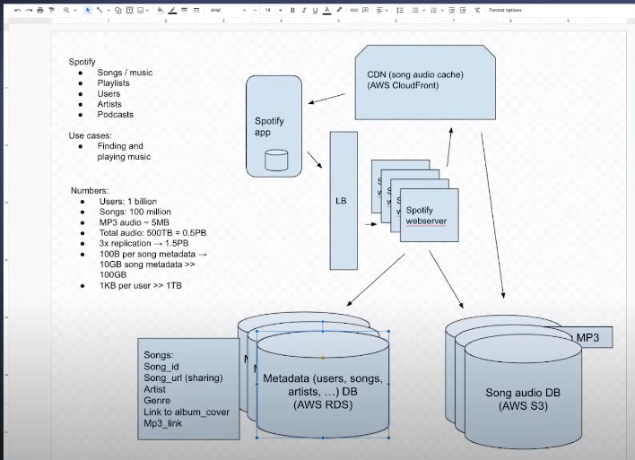

# High-Level System Design: Spotify (Requirements)

---

## ✅ Functional Requirements (FRs)

These define **what** the system should do — the **core features and user capabilities**.

### 🎵 Music Streaming Features
- Stream audio in real-time (songs, albums, podcasts)
- High-quality adaptive bitrate streaming
- Shuffle, repeat, skip, pause/play functionality
- Offline playback (downloaded content)
- Lyrics display in real-time

### 🔍 Search & Discovery
- Search for songs, albums, artists, playlists, podcasts
- Auto-complete and search suggestions
- Filter by genre, mood, language, popularity, etc.

### 📋 Playlist & Library Management
- Create and manage personal playlists
- Follow public/shared playlists
- Like or save songs/albums/podcasts to personal library

### 🧠 Recommendations & Personalization
- Personalized home screen
- Daily Mix, Discover Weekly, Release Radar
- Radio-like stations based on songs/artists
- Collaborative filtering and machine learning-based suggestions

### 🧑 User Account & Profiles
- User signup/login (email, social, phone)
- Manage profile (username, profile picture, bio)
- View and follow other users
- View recently played tracks

### 🔗 Social Features
- Share songs/playlists via social media or links
- Collaborative playlists with friends
- Show current song playing on user profile
- Activity feed or friend listening status

### 🎙️ Podcasts
- Stream or download podcasts
- Subscribe/follow podcasts
- Mark episodes as played/unplayed
- Show progress of partially played episodes

### 📱 Cross-Platform Support
- Support for:
  - iOS and Android mobile apps
  - Web player
  - Desktop applications (macOS/Windows/Linux)
  - Smart TVs and smart speakers
- Seamless transition between devices

### 📡 Real-Time Syncing
- Sync playback across devices
- Show current playing track on all devices

### 💳 Subscription & Billing
- Free and premium tier support
- Payment gateway integration (credit card, UPI, PayPal, etc.)
- Upgrade, cancel, or manage subscription plans

### 🛎️ Notifications
- Push notifications for new releases
- In-app notifications for followers, playlist updates, and suggestions

---

## ✅ Non-Functional Requirements (NFRs)

These define **how** the system performs — its **quality attributes**.

### ⚙️ Performance & Scalability
- Must support **millions of concurrent users**
- Low-latency audio streaming (<300ms startup delay)
- Scalable infrastructure for music delivery
- Efficient indexing and retrieval of metadata (song, album, artist)

### 🕓 Availability & Reliability
- 99.99% uptime (high availability)
- Redundant systems to ensure uninterrupted service
- Automatic failover and retry mechanisms

### 💾 Storage & Content Delivery
- Large-scale media storage (petabytes of audio)
- Use of **CDNs** for fast audio delivery globally
- Support for regional content restrictions (licensing)

### 🔐 Security
- Encrypted streaming (HTTPS, TLS)
- Secure user authentication (OAuth2, 2FA optional)
- DRM and content protection for copyrighted media

### 🌍 Global Distribution
- Geo-distributed data centers
- Region-based content licensing and access control
- Localized recommendations and UI support

### 📊 Data Analytics
- Real-time and batch analytics for user behavior, songs played, etc.
- Logs for system monitoring and usage tracking
- Data pipeline for training ML recommendation models

### 🧠 Personalization (ML/AI)
- Use of machine learning for:
  - Recommendations
  - Playlist generation
  - Search ranking
- User behavior modeling and segmentation

### 📈 Observability & Monitoring
- Real-time monitoring (CPU, memory, streaming errors)
- Alerting for service downtime or performance degradation
- Logging and tracing across microservices

### ♻️ Maintainability & Extensibility
- Modular microservices architecture
- API versioning and backward compatibility
- Easy integration of new features (e.g., live audio, video)

### 🛡️ Compliance & Legal
- GDPR / CCPA compliance
- User data export/deletion
- Content licensing enforcement

---

## 📌 Summary Table

| Category               | Requirement Examples                                              |
|------------------------|-------------------------------------------------------------------|
| Functional             | Audio streaming, playlists, recommendations, podcasts             |
| Security               | Auth, encrypted streaming, DRM, 2FA                               |
| Scalability            | Millions of users, adaptive streaming, content delivery           |
| Availability           | 99.99% uptime, global failover                                    |
| Storage                | Petabyte-scale audio storage, CDN usage                           |
| Performance            | Low latency, high throughput, responsive search                   |
| Personalization        | ML for recommendations and user behavior modeling                 |
| Multi-platform Support | Mobile, Web, Desktop, Smart devices                               |
| Observability          | Monitoring, logging, alerts, tracing                              |
| Compliance             | GDPR, content licensing, regional access controls                 |

