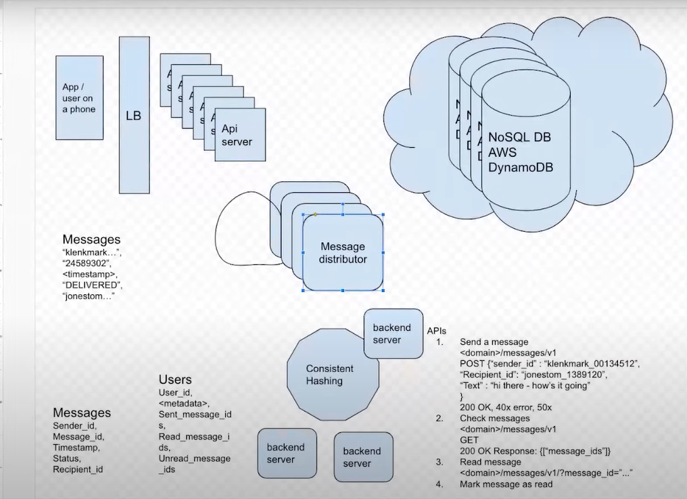

# High-Level System Design: Telegram (Requirements)

---

## ✅ Functional Requirements (FRs)

These define **what** the system should do — the core **features and behaviors**.

### 🧩 Core Messaging Features
- 1-on-1 Chat
- Group Chats
- Channel Broadcasts (one-to-many messaging)
- Message Sending & Receiving
  - Text, emojis, files, photos, videos, locations, voice notes
- Message Delivery Status (sent, delivered, read)
- Editing & Deleting Messages

### 🔐 Security & Privacy
- End-to-End Encrypted Chats (Secret Chats)
- Self-Destructing Messages
- User Blocking & Reporting
- Two-Factor Authentication (2FA)

### 🔊 Media & File Sharing
- Send images, videos, documents, audio files
- Media previews and compression
- Support for large file uploads (up to 2GB or more)

### 👥 User & Identity Management
- Phone-number-based registration and login
- User profile (name, picture, status)
- Contacts syncing (from address book)

### 🛎️ Notifications
- Real-time message push notifications
- Silent notifications (for background updates)

### 🔁 Real-time Features
- Online status and "last seen"
- Typing indicators
- Real-time updates via WebSockets or similar

### 📤 Message History & Sync
- Message history sync across devices
- Cloud-based storage (except for secret chats)

### 🧑‍🤝‍🧑 Groups & Channels
- Admin controls (permissions, bans, invites)
- Supergroups (up to 200K+ users)
- Public/private channels

### 🔍 Search & Discovery
- In-app search for messages, users, files
- Channel and group search by name or username

### 🧩 Bots & APIs
- Support for bots (automated messages, games, payments)
- Developer APIs for integrations

### 📱 Multi-Platform Support
- Native support for:
  - iOS
  - Android
  - Web
  - Desktop (Windows/Linux/macOS)

---

## ✅ Non-Functional Requirements (NFRs)

These define **how** the system performs under different conditions.

### ⚙️ Performance & Scalability
- Must support **millions of concurrent users**
- Low-latency messaging (under 100ms ideally)
- High throughput for message delivery
- Scalable architecture (handle sudden spikes, viral traffic)

### 🕓 Availability & Reliability
- High availability (≥99.99%)
- Zero single points of failure
- Reliable message delivery (with retry mechanisms)

### 💾 Storage
- Efficient media storage (images, files, videos)
- Support for **cloud message history**
- File deduplication and compression

### 🔐 Security
- End-to-end encryption (for secret chats)
- TLS encryption for data in transit
- Encrypted media and message storage
- Anti-spam and anti-abuse protections

### 🌍 Global Distribution
- Geo-distributed data centers (edge caching)
- CDN integration for media delivery
- Low latency for users across continents

### 🧪 Consistency & Durability
- Eventual consistency across devices
- Durable message storage (no message loss)
- Conflict resolution (e.g., edited/deleted messages)

### 📊 Observability & Monitoring
- Logging and metrics collection
- Alerts for system failures or performance issues

### ♻️ Maintainability & Extensibility
- Modular services (e.g., messaging, media, auth)
- Easy to add new features (e.g., voice/video calls)

### 🛡️ Compliance & Governance
- GDPR / CCPA compliance (data deletion, export)
- User consent handling
- Secure data storage policies

---

## 📌 Summary Table

| Category               | Requirements Examples                                      |
|------------------------|------------------------------------------------------------|
| Functional             | Messaging, Media, Groups, Channels, Encryption             |
| Security               | End-to-end encryption, User authentication, 2FA            |
| Scalability            | Millions of users, high throughput                         |
| Availability           | 99.99% uptime, geo-redundancy                              |
| Performance            | Low latency messaging, real-time updates                   |
| Storage                | Cloud message history, media storage, deduplication        |
| Multi-platform Support | iOS, Android, Web, Desktop                                 |
| Extensibility          | Bot APIs, Modular microservices                            |
| Compliance             | GDPR, user privacy, consent                                |
